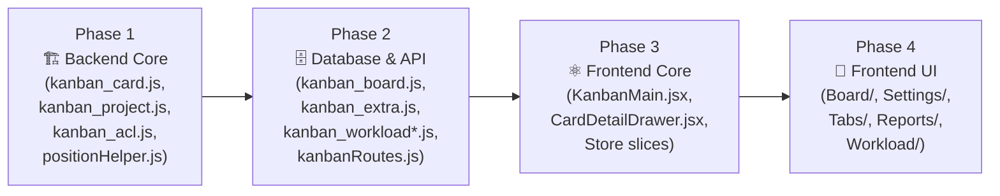

# 🔍 Kanban Module — Comprehensive Code Audit Plan

**Auditor Role:** Expert Senior Software Architect & Technical Auditor  
**Stack:** React (Zustand) Frontend · Node.js/Express Backend · PostgreSQL  
**Date:** 2026-04-27  
**Status:** ⏳ AWAITING APPROVAL

---

## 1. Project Inventory

### 1.1 Frontend — `ENG-Frontend/src/components/engineer/kanban/`

| Path | File | Size | Purpose |
|:-----|:-----|-----:|:--------|
| `/` | `KanbanMain.jsx` | **84 KB** | Root orchestrator — routing, tab management, board groups, preferences |
| `/Board/` | `BoardView.jsx` | 36 KB | Board canvas — lists, drag-and-drop, board toolbar |
| `/Board/` | `KanbanList.jsx` | 19 KB | Individual list column — card rendering, list DnD |
| `/Board/` | `KanbanCard.jsx` | 24 KB | Board card component — visual indicators, priority badges |
| `/CardDetail/` | `CardDetailDrawer.jsx` | **188 KB** | Card detail drawer — the single largest file in the project |
| `/CardDetail/` | `AttachmentViewManager.jsx` | 15 KB | Attachment preview & management |
| `/Settings/` | `BoardSettingsDrawer.jsx` | 71 KB | Board config — members, labels, groups, tab ordering |
| `/Settings/` | `ProjectSettingsDrawer.jsx` | 40 KB | Project config — members, ownership, lifecycle |
| `/Tabs/` | `DashboardTab.jsx` | 6 KB | Dashboard statistics overview |
| `/Tabs/` | `ProjectsTab.jsx` | 7 KB | Project list with status tabs |
| `/Tabs/` | `ReportsTab.jsx` | ~0.3 KB | Thin wrapper |
| `/Tabs/` | `WorkloadTab.jsx` | ~0.3 KB | Thin wrapper |
| `/Tabs/components/` | `ProjectGridCard.jsx` | 8 KB | Project card in grid view |
| `/Tabs/components/` | `ProjectListRow.jsx` | 5 KB | Project card in list view |
| `/Tabs/components/` | `StatCard.jsx` | 1 KB | Dashboard stat widget |
| `/Reports/` | `ReportDashboard.jsx` | 22 KB | Reports landing page |
| `/Reports/` | `ProjectReport.jsx` | 22 KB | Per-project report |
| `/Reports/` | `MonthlyReport.jsx` | 44 KB | Monthly aggregate report |
| `/Reports/` | `ExportRenderer.jsx` | 47 KB | html2canvas export rendering |
| `/Reports/` | `reportHelpers.js` | 15 KB | Report calculation utilities |
| `/Workload/` | `WorkloadDashboard.jsx` | 27 KB | Workload gauge & team view |
| `/UserGuide/` | `UserGuideDrawer.jsx` | 13 KB | Global help system |
| `/UserGuide/` | `BoardGuideDrawer.jsx` | 9 KB | Board-specific guide |
| `/store/` | `kanbanStore.js` | 3 KB | Zustand store root (hub) |
| `/store/` | `projectSlice.js` | 14 KB | Project state slice |
| `/store/` | `boardSlice.js` | 30 KB | Board/list/label state slice |
| `/store/` | `cardSlice.js` | 33 KB | Card/checklist/comment state slice |
| `/hooks/` | `useKanbanPermissions.js` | 4 KB | Permission derivation hook |
| `/constants/` | `kanbanConstants.js` | 4 KB | Shared constants & enums |
| `/helpers/` | `iconMapper.js` | 3 KB | Icon name → component mapper |

**Frontend Total:** ~29 files, **~730 KB** of source code

### 1.2 Backend — `ENG-Backend/api/kanban/`

| File | Size | Purpose |
|:-----|-----:|:--------|
| `kanbanRoutes.js` | 9 KB | Express route definitions |
| `kanban_acl.js` | 16 KB | Access control logic |
| `kanban_board.js` | 36 KB | Board CRUD, lists, labels, members |
| `kanban_card.js` | **64 KB** | Card CRUD, tasks, comments, attachments, hierarchy |
| `kanban_extra.js` | 19 KB | Notifications, preferences, custom fields |
| `kanban_issue.js` | 5 KB | Issue tracking |
| `kanban_project.js` | 25 KB | Project CRUD, lifecycle, membership |
| `kanban_workload.js` | 9 KB | Workload aggregation queries |
| `kanban_workload_calculator.js` | 6 KB | Workload algorithm implementation |
| `positionHelper.js` | 5 KB | List/card position calculations |
| `websocket.js` | 2 KB | Socket.io event broadcasting |
| `db_migration_decoupled.sql` | 1 KB | SQL migration script |
| `migrate_dependencies.js` | 1 KB | One-off data migration script |

**Backend Total:** 13 files, **~198 KB** of source code

---

## 2. Audit Domains & Checklist

### Domain A: Logic & Code Quality

> Identify "weird" or suboptimal logic, edge-case bugs, anti-patterns, and best-practice violations.

#### A1 — Frontend Logic

| # | Check | Target Files | What to Look For |
|:-:|:------|:-------------|:-----------------|
| A1.1 | **God-Component Anti-Pattern** | `KanbanMain.jsx` (84 KB), `CardDetailDrawer.jsx` (188 KB), `BoardSettingsDrawer.jsx` (71 KB) | Monolithic files that should be decomposed. Assess cohesion, local state explosion, and render complexity |
| A1.2 | **State Management Integrity** | `kanbanStore.js`, all 3 slices | Zustand `set()` mutations — are they immutable? Race conditions with optimistic updates? Stale closure traps? |
| A1.3 | **Permission Logic Consistency** | `useKanbanPermissions.js` vs `kanban_acl.js` | Frontend/backend permission parity — any gaps where frontend allows but backend blocks (or vice versa)? |
| A1.4 | **Edge-Case Handling** | All card/board mutation flows | Empty arrays, null projects, deleted entities still referenced, edge cases in drag-and-drop position calculations |
| A1.5 | **useEffect Hygiene** | `KanbanMain.jsx`, `CardDetailDrawer.jsx`, `BoardView.jsx` | Missing dependencies, stale closures, cleanup functions, infinite re-render loops |
| A1.6 | **Error Boundary Coverage** | All components | Are API failures handled gracefully? Uncaught promise rejections? Missing try/catch? |
| A1.7 | **Initialization Sequencing** | `KanbanMain.jsx` (Initialization Bridge) | Race conditions between `fetchUserPreferences`, `fetchProjects`, and URL-based project selection |
| A1.8 | **Conditional Rendering Logic** | All JSX files | Unsafe chaining (`&&` with 0/empty-string), ternary nesting depth, missing key props in lists |

#### A2 — Backend Logic

| # | Check | Target Files | What to Look For |
|:-:|:------|:-------------|:-----------------|
| A2.1 | **Input Validation & Sanitization** | All route handlers | Missing parameter validation, SQL injection vectors, type coercion issues |
| A2.2 | **ACL Bypass Vectors** | `kanban_acl.js`, `kanbanRoutes.js` | Routes missing ACL middleware, inconsistent permission checks, IDOR vulnerabilities |
| A2.3 | **Transaction Safety** | `kanban_card.js`, `kanban_project.js` | Multi-step mutations without transactions — data inconsistency on partial failure |
| A2.4 | **Error Handling Patterns** | All backend files | Inconsistent error response formats, swallowed errors, missing HTTP status codes |
| A2.5 | **Recursive CTE Safety** | `kanban_card.js` (hierarchy logic) | Unbounded recursion depth, missing `LIMIT`/`MAXRECURSION`, cycle detection robustness |
| A2.6 | **Position Calculation Edge Cases** | `positionHelper.js` | Floating-point precision drift, rebalancing triggers, gap exhaustion scenarios |
| A2.7 | **WebSocket Broadcast Safety** | `websocket.js` | Over-broadcasting, missing room scoping, data leakage across projects |

---

### Domain B: Redundancy & Duplication

> Check for overlapping functions, duplicated logic, and dead code.

| # | Check | Target Files | What to Look For |
|:-:|:------|:-------------|:-----------------|
| B1 | **Cross-File Logic Duplication** | All frontend components | Identical permission checks, date formatting, status mapping repeated across files instead of using shared utilities |
| B2 | **Store vs. Component Duplication** | Slices vs. `KanbanMain.jsx`, `CardDetailDrawer.jsx` | Logic that should live in the store but is reimplemented in components |
| B3 | **Constants & Magic Values** | All files vs. `kanbanConstants.js` | Hardcoded strings/numbers that should reference the constants file |
| B4 | **Dead Code Detection** | All files | Unused imports, commented-out code blocks, unreachable branches, deprecated functions |
| B5 | **Backend Handler Overlap** | `kanban_board.js` vs `kanban_card.js` vs `kanban_extra.js` | Functions that do similar things (e.g., member lookup, notification creation) duplicated across controllers |
| B6 | **Report Helper Duplication** | `reportHelpers.js` vs. Report components | Calculation logic that may be duplicated between the helper and the consuming components |
| B7 | **Migration & Script Artifacts** | `db_migration_decoupled.sql`, `migrate_dependencies.js` | One-off scripts still in the production codebase that should be archived |

---

### Domain C: Performance & Scalability

> Pinpoint areas where execution is slow, memory-intensive, or inefficient.

#### C1 — Frontend Performance

| # | Check | Target Files | What to Look For |
|:-:|:------|:-------------|:-----------------|
| C1.1 | **Render Optimization** | `KanbanMain.jsx`, `BoardView.jsx`, `KanbanList.jsx`, `KanbanCard.jsx` | Missing `React.memo`, `useMemo`, `useCallback` on hot paths. Unnecessary re-renders from Zustand selector granularity |
| C1.2 | **Zustand Selector Efficiency** | All store consumers | Using `useKanbanStore()` without selectors (subscribing to entire store), causing component-wide re-renders |
| C1.3 | **Large Component Bundles** | `CardDetailDrawer.jsx` (188 KB), `KanbanMain.jsx` (84 KB) | Lazy loading opportunities — are these code-split or loaded eagerly? |
| C1.4 | **DnD Performance** | `BoardView.jsx`, `KanbanList.jsx` | Drag-and-drop library overhead, measuring during drag, unnecessary DOM recalculations |
| C1.5 | **Export Renderer Memory** | `ExportRenderer.jsx` | `html2canvas` memory pressure with `scale: 2`, canvas size limits, cleanup of blob URLs |
| C1.6 | **Debouncing & Throttling** | All input handlers, search, auto-save | Missing debounce on rapid-fire API calls (e.g., card description save, search filters) |

#### C2 — Backend Performance

| # | Check | Target Files | What to Look For |
|:-:|:------|:-------------|:-----------------|
| C2.1 | **Middleware Overhead** | `kanbanRoutes.js`, `kanban_acl.js` | Redundant permission checks per request chain (double-checking project access on every sub-entity call) |
| C2.2 | **Response Payload Size** | `kanban_card.js` (`GetCards`) | Over-fetching — are snapshot responses returning unnecessary fields? |
| C2.3 | **Concurrency & Connection Pooling** | All DB query patterns | Are queries using connection pools correctly? Long-held connections? |
| C2.4 | **File Upload Processing** | `kanban_card.js` (attachments) | Synchronous file operations blocking the event loop |

---

### Domain D: Database Audit

> Analyze queries, indexing strategies, and data-fetching patterns.

| # | Check | Target Files | What to Look For |
|:-:|:------|:-------------|:-----------------|
| D1 | **N+1 Query Patterns** | `kanban_card.js`, `kanban_board.js`, `kanban_workload.js` | Loops that issue individual queries per card/member instead of batch fetching |
| D2 | **Query Complexity** | `kanban_card.js` (`GetCards`, `GetCard`) | Excessive JOINs, sub-selects, and aggregation that could be simplified or materialized |
| D3 | **Indexing Strategy** | `db_migration_decoupled.sql`, inline schema references | Missing indexes on frequently queried columns (`project_id`, `board_id`, `list_id`, `status`, `parent_id`) |
| D4 | **JSONB Performance** | `kanban_extra.js` (preferences) | JSONB read/write patterns — are we reading the full JSONB blob to update one key? |
| D5 | **Transaction Isolation** | `kanban_project.js`, `kanban_card.js` | Correct isolation levels for concurrent writes (e.g., position reordering, member management) |
| D6 | **Data Type Efficiency** | All SQL queries | Mismatched types in WHERE clauses causing implicit casts, oversized varchar columns |
| D7 | **Workload Aggregation Queries** | `kanban_workload.js`, `kanban_workload_calculator.js` | Full table scans, missing date range filters, unbounded aggregation |

---

## 3. Execution Strategy

The audit will proceed in **4 phases**, reporting findings after each:

| Phase | Focus | Files | Domains Covered |
|:-----:|:------|:------|:----------------|
| **1** | Backend Core Logic | `kanban_card.js`, `kanban_project.js`, `kanban_acl.js`, `positionHelper.js`, `websocket.js` | A2, B5, D1-D3, D5 |
| **2** | Database & Supporting APIs | `kanban_board.js`, `kanban_extra.js`, `kanban_workload.js`, `kanban_workload_calculator.js`, `kanbanRoutes.js`, `kanban_issue.js` | A2, B5, B7, C2, D1-D7 |
| **3** | Frontend Core & State | `KanbanMain.jsx`, `CardDetailDrawer.jsx`, `kanbanStore.js`, `projectSlice.js`, `boardSlice.js`, `cardSlice.js`, `useKanbanPermissions.js`, `kanbanConstants.js` | A1, B1-B4, C1.1-C1.3 |
| **4** | Frontend UI Components | `BoardView.jsx`, `KanbanList.jsx`, `KanbanCard.jsx`, `BoardSettingsDrawer.jsx`, `ProjectSettingsDrawer.jsx`, all Tabs/Reports/Workload/UserGuide | A1, B1, B6, C1.4-C1.6 |

---

## 4. Severity Classification

All findings will be tagged with a severity level:

| Severity | Icon | Meaning | Examples |
|:---------|:----:|:--------|:--------|
| **Critical** | 🔴 | Security flaw or data corruption risk | ACL bypass, SQL injection, race condition causing data loss |
| **High** | 🟠 | Significant performance or logic bug | N+1 queries, missing transactions, incorrect permission gating |
| **Medium** | 🟡 | Code quality or maintainability issue | God-components, duplicated logic, missing error handling |
| **Low** | 🔵 | Cosmetic or minor improvement | Dead code, inconsistent naming, missing memoization |
| **Info** | ⚪ | Observation or suggestion | Architecture recommendations, refactoring opportunities |

---

## 5. Deliverables

Upon completion of all 4 phases, the final report will include:

1. **Executive Summary** — High-level findings count by severity
2. **Detailed Findings Table** — Per-file issues with code references, severity, and recommended fixes
3. **Quick Wins List** — Low-effort, high-impact fixes that can be applied immediately
4. **Refactoring Roadmap** — Longer-term architectural improvements ranked by ROI
5. **Database Optimization Playbook** — Specific index recommendations, query rewrites, and schema improvements

---

> [!IMPORTANT]
> **This is the Audit Plan only.** No code has been reviewed in detail yet.  
> Please review this plan and confirm approval to proceed with **Phase 1**.  
> If you'd like to add, remove, or re-prioritize any checklist items, let me know.
