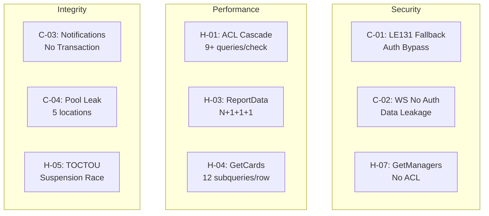

# 🔍 Phase 1 Audit Report — Backend Core Logic

**Files Audited:** `kanban_card.js`, `kanban_project.js`, `kanban_acl.js`, `positionHelper.js`, `websocket.js`, `kanbanRoutes.js`  
**Date:** 2026-04-27  
**Status:** ✅ COMPLETE

---

## Executive Summary

| Severity | Count |
|:---------|------:|
| 🔴 Critical | **4** |
| 🟠 High | **7** |
| 🟡 Medium | **8** |
| 🔵 Low | **5** |
| ⚪ Info | **3** |
| **Total** | **27** |

---

## Detailed Findings

### 🔴 CRITICAL — Security & Data Integrity

---

#### C-01: Hardcoded User Fallback `'LE131'` — Authentication Bypass Vector

**Files:** `kanban_card.js` (27 occurrences), `kanban_issue.js` (3), `kanban_extra.js` (2)  
**Checklist:** A2.1, A2.2

Every mutation handler uses a fallback chain like:
```javascript
// kanban_card.js:163
const uCode = req.user?.empno || req.body?.owner_u_code || req.query?.owner_u_code || 'LE131';
```

**Problems:**
1. **Authentication Bypass**: If JWT middleware fails silently or is missing, ALL mutations default to user `LE131` — creating cards, deleting comments, uploading attachments as that user.
2. **User Spoofing via Body/Query**: `req.body?.owner_u_code` and `req.query?.owner_u_code` allow any authenticated user to impersonate another by sending `{ "owner_u_code": "VICTIM_CODE" }` in the request body. The ACL checks use `req.user?.empno` but the *action attribution* uses the spoofed `uCode`.
3. **Inconsistent Priority**: Some handlers check `req.body` first (`AddCardMember` L566, `AddComment` L900), others check `req.user` first — creating unpredictable behavior.

**Impact:** An attacker can attribute actions to arbitrary users, or exploit missing auth to act as `LE131`.

**Recommendation:**
```javascript
// Replace ALL occurrences with a single utility:
const getAuthenticatedUser = (req) => {
    if (!req.user?.empno) throw new AuthError('Unauthorized');
    return req.user.empno;
};
```

---

#### C-02: WebSocket Has No Authentication or Authorization

**File:** [websocket.js](file:///d:/97_Projects/00_System/EngineerSystem/apps/ENG-Backend/api/kanban/websocket.js) L15-63  
**Checklist:** A2.7, A2.8

```javascript
io.on('connection', (socket) => {
    socket.on('board:join', (boardId) => {
        socket.join(`board:${boardId}`);  // No auth check!
    });
});
```

**Problems:**
1. **No JWT verification** on WebSocket connection — any client can connect.
2. **No ACL check on `board:join`** — any connected client can join ANY board room by sending an arbitrary `boardId`, receiving all real-time card/comment/member updates regardless of project membership or privacy.
3. **Cross-project data leakage** — violates project isolation (A2.8).
4. **CORS `origin: '*'`** — accepts connections from any domain.

**Impact:** Complete bypass of the carefully constructed ACL system for real-time data. Private project data streams to unauthorized clients.

**Recommendation:**
```javascript
// 1. Verify JWT on connection
io.use((socket, next) => {
    const token = socket.handshake.auth?.token;
    try {
        socket.user = jwt.verify(token, SECRET);
        next();
    } catch { next(new Error('Authentication required')); }
});

// 2. Verify board access on join
socket.on('board:join', async (boardId) => {
    if (await canViewBoard(socket.user, boardId)) {
        socket.join(`board:${boardId}`);
    }
});
```

---

#### C-03: `UpdateProject` Status Change Notifications — N+1 Without Transaction

**File:** [kanban_project.js](file:///d:/97_Projects/00_System/EngineerSystem/apps/ENG-Backend/api/kanban/kanban_project.js) L196-211  
**Checklist:** A2.3, D1

```javascript
// L197: Status change detected
const members = await engPool.query("SELECT u_code FROM kb_project_membership WHERE project_id=$1", [id]);
for (const member of members.rows) {
    if (member.u_code !== uCode) {
        await engPool.query(`INSERT INTO kb_notification ...`, [...]);
    }
}
```

**Problems:**
1. **No transaction**: The project UPDATE at L180 already committed. If notification inserts fail mid-loop, some members get notified and others don't — inconsistent state.
2. **N+1 pattern**: Individual INSERT per member. A project with 50 members = 50 individual queries.
3. **The main UPDATE itself uses `engPool.query` instead of a transaction** — the entire `UpdateProject` handler (L150-218) performs multiple sequential queries without transactional safety.

**Impact:** Partial notification delivery, poor performance at scale, potential data inconsistency if the project update succeeds but notifications fail.

**Recommendation:** Wrap in a transaction with batch INSERT:
```sql
INSERT INTO kb_notification (recipient_u_code, actor_u_code, notif_type, notif_data)
SELECT u_code, $1, 'project_status_changed', $2
FROM kb_project_membership WHERE project_id = $3 AND u_code != $1
```

---

#### C-04: `AddCardLabel` / `RemoveCardLabel` — Connection Pool Leak

**File:** [kanban_card.js](file:///d:/97_Projects/00_System/EngineerSystem/apps/ENG-Backend/api/kanban/kanban_card.js) L686-722  
**Checklist:** A2.4, C2.3

```javascript
// L697-699: No try/finally around client
const client = await engPool.connect();
await logAction(client, id, uCode, 'label_added', { label_id, name: label.name });
client.release();
```

**Problem:** If `logAction` throws, `client.release()` is never called → **connection pool exhaustion**. Under load, the server will hang waiting for available connections.

This pattern repeats in:
- `AddCardLabel` (L697-699)
- `RemoveCardLabel` (L716-718)
- `CreateTask` (L815-819)
- `UpdateTask` (L851-856)
- `UploadAttachment` (L1094-1096)

**Recommendation:** Always use try/finally:
```javascript
const client = await engPool.connect();
try {
    await logAction(client, ...);
} finally {
    client.release();
}
```

---

### 🟠 HIGH — Logic Bugs & Performance

---

#### H-01: `canEditBoard` — Redundant ACL Calls & Query Cascade

**File:** [kanban_acl.js](file:///d:/97_Projects/00_System/EngineerSystem/apps/ENG-Backend/api/kanban/kanban_acl.js) L228-260  
**Checklist:** C2.1

A single `canEditBoard` call triggers a cascade of up to **9 DB queries**:

```
canEditBoard(boardId)
  → getBoardMembership(boardId, uCode)          // 1 query
  → SELECT board+project+status                  // 1 query  
  → isSuperAdmin(req)                            // 1-2 queries (JWT check + DB fallback)
  → canManageProject(projectId)                   
    → isSuperAdmin(req)                          // 1-2 queries (AGAIN!)
    → SELECT is_private                          // 1 query
    → getProjectMembership(projectId, uCode)     // 1 query
    → isManagerOrCoord(req)                      // 1-2 queries
  → getProjectMembership(projectId, uCode)       // 1 query (DUPLICATE!)
  → isManagerOrCoord(req)                        // 1-2 queries (AGAIN!)
```

**Problem:** `isSuperAdmin` is called **2-3 times per request**, each potentially hitting the DB. `getProjectMembership` is called twice. `isManagerOrCoord` is called twice.

**Impact:** Every card edit operation starts with 7-13 DB queries just for permission checks, before any actual work.

**Recommendation:** Cache role lookups per-request using `req._aclCache`:
```javascript
const isSuperAdmin = async (req) => {
    if (req._aclCache?.isSuperAdmin !== undefined) return req._aclCache.isSuperAdmin;
    // ... actual check ...
    req._aclCache = req._aclCache || {};
    req._aclCache.isSuperAdmin = result;
    return result;
};
```

---

#### H-02: `canEditCard` Calls `canEditBoard` — Deep Query Cascade for Every Card Op

**File:** [kanban_acl.js](file:///d:/97_Projects/00_System/EngineerSystem/apps/ENG-Backend/api/kanban/kanban_acl.js) L309-329  
**Checklist:** C2.1

`canEditCard` calls `canEditBoard` as its final fallback (L328). Combined with H-01, a single card edit triggers up to **12-15 DB queries** just for ACL.

The `UpdateCard` handler (L260-442) calls `canManageCard` OR `canEditBoard` first (L271), then `canEditCard` (L308) — meaning two full ACL cascades per request.

---

#### H-03: `GetReportData` — Severe N+1 Problem (3 Levels Deep)

**File:** [kanban_project.js](file:///d:/97_Projects/00_System/EngineerSystem/apps/ENG-Backend/api/kanban/kanban_project.js) L437-548  
**Checklist:** D1, D2

```javascript
for (const board of boards) {                    // Level 1: per board
    const { rows: lists } = await query(...)     
    for (const list of lists) {                  // Level 2: per list
        const { rows: cards } = await query(...)
        for (const card of cards) {              // Level 3: per card
            const { rows: issues } = await query(...)   // N+1+1+1!
        }
    }
    const { rows: labels } = await query(...)    // per board
    const { rows: actions } = await query(...)   // per board
}
```

**Impact:** A project with 5 boards × 6 lists × 20 cards = **600+ individual queries** for a single API call.

**Recommendation:** Flatten with JOINs or use batch queries with `WHERE ... IN (...)`.

---

#### H-04: `GetCards` Query — Heavy Correlated Subqueries Per Row

**File:** [kanban_card.js](file:///d:/97_Projects/00_System/EngineerSystem/apps/ENG-Backend/api/kanban/kanban_card.js) L100-152  
**Checklist:** D2

The `GetCards` query has **10 correlated subqueries** per card row:
1. `assignees` (ARRAY subquery)
2. `label_ids` (ARRAY subquery)
3. `completed_tasks` (COUNT + JOIN)
4. `total_tasks` (COUNT + JOIN)
5. `tasks` (json_agg + JOIN)
6. `comment_count` (COUNT)
7. `attachment_count` (COUNT)
8. `issue_count` (COUNT)
9. `action_in_progress_at` (JOIN + pattern match + ORDER + LIMIT)
10. `action_done_at` (same as #9)
11. `total_children_count` (COUNT)
12. `completed_children_count` (COUNT + JOIN + pattern match)

The `action_in_progress_at` and `action_done_at` subqueries (#9, #10) are particularly expensive: each casts a JSONB field to integer (`(NULLIF(a.action_data->>'to_list_id', ''))::integer`), then JOINs and does `LIKE` pattern matching.

**Impact:** With 50 cards per list, this is 50 × 12 = **600 correlated subquery executions**.

**Recommendation:**
- Replace correlated subqueries with lateral JOINs or pre-aggregated CTEs
- Add indexes: `CREATE INDEX idx_kb_action_card_type ON kb_action(card_id, action_type);`
- Consider materializing `action_in_progress_at` and `action_done_at` as card columns updated on move

---

#### H-05: `UpdateCard` — Suspension Check Uses `engPool` Instead of Transaction Client

**File:** [kanban_card.js](file:///d:/97_Projects/00_System/EngineerSystem/apps/ENG-Backend/api/kanban/kanban_card.js) L292  
**Checklist:** A2.3

```javascript
if (await checkCascadingSuspension(engPool, id)) {  // Uses pool, not client
    return res.status(403).json({...});
}
// ... later ...
const client = await engPool.connect();
await client.query('BEGIN');
```

The suspension check at L292 reads from the shared pool outside the transaction. Between the check and the actual update, another request could change the suspension status — a **TOCTOU race condition**.

---

#### H-06: Duplicated List Status Detection Logic (Done/InProgress pattern matching)

**Files:** `kanban_card.js` L326, L339, L376, L1218, L1219, L1231; `kanban_project.js` L486, L494  
**Checklist:** B3, B5

The "Done" list detection pattern is copy-pasted across 8+ locations:
```javascript
// Repeated everywhere:
destName.includes('done') || destName.includes('completed') || destName.includes('finish') || destName.includes('เสร็จ')
```

And "In Progress" detection:
```javascript
destName.includes('in progress') || destName.includes('working') || destName.includes('check')
```

**Problem:** If a new list naming pattern is added (e.g., `'ทำเสร็จแล้ว'`), it must be updated in 8+ places. Easy to miss one.

**Recommendation:** Extract to `positionHelper.js` or a new `listHelper.js`:
```javascript
const DONE_PATTERNS = ['done', 'completed', 'finish', 'เสร็จ'];
const IN_PROGRESS_PATTERNS = ['in progress', 'working', 'check', 'กำลังทำ'];

const isDoneList = (name) => DONE_PATTERNS.some(p => name.toLowerCase().includes(p));
const isInProgressList = (name) => IN_PROGRESS_PATTERNS.some(p => name.toLowerCase().includes(p));
```

---

#### H-07: `GetManagers` — No ACL Check

**File:** [kanban_project.js](file:///d:/97_Projects/00_System/EngineerSystem/apps/ENG-Backend/api/kanban/kanban_project.js) L277-287  
**Route:** `GET /api/kanban/projects/:id/managers`  
**Checklist:** A2.2

```javascript
const GetManagers = async (req, res) => {
    const { id } = req.params;
    // No auth check! No canAccessProject check!
    const { rows } = await engPool.query("SELECT * FROM kb_project_membership...", [id]);
    res.json({ data: rows });
};
```

**Problem:** Any authenticated user (or even unauthenticated, if JWT middleware is loose) can enumerate all members and their roles for ANY project — including private ones. This leaks organizational structure.

---

### 🟡 MEDIUM — Code Quality & Maintainability

---

#### M-01: Inline `require('./kanban_acl')` Inside Function Bodies

**File:** `kanban_project.js` L160, L300, L354; `kanban_board.js` L264, L323  
**Checklist:** B4

```javascript
const UpdateProject = async (req, res) => {
    // ...
    const { isSuperAdmin } = require('./kanban_acl');  // WHY? Already imported at top!
    const admin = await isSuperAdmin(req);
```

`isSuperAdmin` is already imported at the top of `kanban_project.js` (L9). These inline re-requires are **dead code** — Node caches modules so they don't cause bugs, but they signal confusion and add clutter.

---

#### M-02: `UpdateCard` Logs `card_updated` on Every Update Regardless

**File:** [kanban_card.js](file:///d:/97_Projects/00_System/EngineerSystem/apps/ENG-Backend/api/kanban/kanban_card.js) L433  
**Checklist:** A1.4

```javascript
// L419-432: Specific event logs (card_moved, due_date_changed, etc.)
// L433: THEN this generic one always fires
await logAction(client, id, uCode, 'card_updated', { name, description, is_closed });
```

Every update creates a `card_updated` log entry *in addition to* specific entries like `card_moved`, `due_date_changed`, etc. This creates duplicate noise in the activity log.

---

#### M-03: `DuplicateCard` Doesn't Copy `priority`, `estimated_hours`, or `parent_id`

**File:** [kanban_card.js](file:///d:/97_Projects/00_System/EngineerSystem/apps/ENG-Backend/api/kanban/kanban_card.js) L507-523  
**Checklist:** A1.4

The INSERT for duplicated cards omits several fields that the original card may have:
- `priority` (defaults to null instead of copying)
- `estimated_hours` (defaults to null)
- `is_private` (defaults to false)

---

#### M-04: `DeleteProject` — No Cascade Verification / No Soft Delete

**File:** [kanban_project.js](file:///d:/97_Projects/00_System/EngineerSystem/apps/ENG-Backend/api/kanban/kanban_project.js) L220-235  
**Checklist:** A2.3

```javascript
await engPool.query('DELETE FROM kb_project WHERE id = $1', [id]);
```

This relies entirely on database CASCADE constraints. No explicit cleanup of:
- Board memberships
- Card memberships  
- Uploaded attachment files on disk
- WebSocket room cleanup

If CASCADE is missing on any FK, orphaned records remain.

---

#### M-05: `CreateProject` — Skips Owner Membership for "Waiting" Status

**File:** [kanban_project.js](file:///d:/97_Projects/00_System/EngineerSystem/apps/ENG-Backend/api/kanban/kanban_project.js) L132-138  
**Checklist:** A1.4

```javascript
if (String(project.status).toLowerCase() !== 'waiting') {
    await client.query("INSERT INTO kb_project_membership ... 'owner'", [project.id, uCode]);
}
```

If a project is created with `status: 'waiting'`, the creator is NOT added as an owner member. But `owner_u_code` is set in `kb_project`. This creates a mismatch — the project has an `owner_u_code` but no membership record, so `canManageProject` will fail for the creator (it checks membership, not `owner_u_code`).

---

#### M-06: `checkCascadingSuspension` Takes `client` but `UpdateCard` Passes `engPool`

**File:** [kanban_card.js](file:///d:/97_Projects/00_System/EngineerSystem/apps/ENG-Backend/api/kanban/kanban_card.js) L34, L292  
**Checklist:** A2.3

The helper is designed to accept a `client` parameter for transactional reads, but `UpdateCard` passes `engPool` (the general pool) instead. This is both a semantic mismatch and a TOCTOU risk (see H-05).

---

#### M-07: Active `console.log` in `isSuperAdmin` Production Code

**File:** [kanban_acl.js](file:///d:/97_Projects/00_System/EngineerSystem/apps/ENG-Backend/api/kanban/kanban_acl.js) L62  
**Checklist:** B4

```javascript
console.log(`isSuperAdmin :`, jwtDept, jwtRole);  // Fires on EVERY ACL check!
```

Combined with H-01 (isSuperAdmin called 2-3× per request), this generates substantial log noise in production. Similar debug logs exist in `AddCardMember` (L567), `RemoveCardMember` (L649), and `AddComment` (L901).

---

#### M-08: `UpdateCard` — Suspension Toggle Uses Pool But Main Update Uses Transaction

**File:** [kanban_card.js](file:///d:/97_Projects/00_System/EngineerSystem/apps/ENG-Backend/api/kanban/kanban_card.js) L270-289  
**Checklist:** A2.3

The suspension update path (L274) uses `engPool.query` directly, while the rest of the handler (L315+) uses a transaction `client`. If the request contains both `is_suspended` and other fields, the suspension update commits immediately but the remaining fields could roll back — leaving inconsistent state.

---

### 🔵 LOW — Minor Improvements

---

#### L-01: `positionHelper.js` — `findBeginnings` Mutates Input Array

**File:** [positionHelper.js](file:///d:/97_Projects/00_System/EngineerSystem/apps/ENG-Backend/api/kanban/positionHelper.js) L18-19  
**Checklist:** A2.6

```javascript
function findBeginnings(positions) {
    positions.unshift(0);     // Mutates the original array!
    let prevPosition = positions.pop();  // Also mutates!
```

Callers use spread `[...lowers, targetPosition]` (L109), so this doesn't currently cause bugs. But the function contract is fragile — if anyone passes a reference directly, silent data corruption occurs.

---

#### L-02: `positionHelper.js` — `getRepositionsMap` Uses Position as Map Key

**File:** [positionHelper.js](file:///d:/97_Projects/00_System/EngineerSystem/apps/ENG-Backend/api/kanban/positionHelper.js) L40-77  
**Checklist:** A2.6

Using floating-point `position` values as object keys for `repositionsMap` is inherently fragile. JavaScript converts them to strings, and floating-point precision issues could cause key mismatches. This is mitigated by the ported Planka algorithm design but is a latent risk.

---

#### L-03: `DeleteTaskList` — Non-Atomic Delete (Tasks Then List)

**File:** [kanban_card.js](file:///d:/97_Projects/00_System/EngineerSystem/apps/ENG-Backend/api/kanban/kanban_card.js) L878-892  
**Checklist:** A2.3

```javascript
await engPool.query('DELETE FROM kb_task WHERE task_list_id=$1', [id]);
await engPool.query('DELETE FROM kb_task_list WHERE id=$1', [id]);
```

Two separate queries without a transaction. If the second fails, tasks are orphaned.

---

#### L-04: `GetActions` — Missing ACL Check

**File:** [kanban_card.js](file:///d:/97_Projects/00_System/EngineerSystem/apps/ENG-Backend/api/kanban/kanban_card.js) L1308-1326  
**Checklist:** A2.2

No `canViewCard` check on the actions endpoint. Any authenticated user can view the activity log of any card by ID.

---

#### L-05: WebSocket `board:join` Input Not Validated

**File:** [websocket.js](file:///d:/97_Projects/00_System/EngineerSystem/apps/ENG-Backend/api/kanban/websocket.js) L30  
**Checklist:** A2.1

`boardId` from the client is used directly without type checking or sanitization. Malformed input (objects, arrays, very long strings) could cause unexpected behavior.

---

### ⚪ INFO — Observations & Suggestions

---

#### I-01: Zero Unit Test Coverage for Kanban Module

**Checklist:** A2.9

Test files exist only for `tests/mtc/` (sdsV2Helpers, formulaService, adminConfig). **No test files exist for any Kanban module code** — not for ACL logic, position calculations, workload algorithms, or hierarchy validation.

**At-Risk Areas:**
- `positionHelper.js` — mathematical algorithm with edge cases
- `kanban_acl.js` — 15 permission functions with complex interaction
- `checkCircularDependency` / `checkDescendantsDone` — recursive CTE logic
- Workload calculator (Phase 2)

---

#### I-02: `kanban_card.js` at 1351 Lines — God-Module

The file handles Cards, Memberships, Labels, Task Lists, Tasks, Comments, Attachments, Notifications, Reorder, and Activity Logs — 10 distinct domains in one file. This exceeds maintainable size.

**Suggested decomposition:**
- `kanban_card_crud.js` — GetCards, CreateCard, GetCard, UpdateCard, DeleteCard, DuplicateCard, ReorderCard
- `kanban_card_membership.js` — AddCardMember, RemoveCardMember
- `kanban_card_tasks.js` — Task lists & tasks CRUD
- `kanban_card_comments.js` — Comment CRUD + notifications
- `kanban_card_attachments.js` — Upload/Delete/Update attachments
- `kanban_notifications.js` — GetNotifications, MarkRead, MarkAllRead

---

#### I-03: `positionHelper.js` — Algorithm is Sound

The position calculation algorithm (ported from Planka) is well-implemented with proper:
- Gap management (65536 default)
- Collision detection and local rebalancing
- Full rebalance fallback
- MAX_POSITION ceiling

`calcMidPosition` handles all null cases correctly. No issues found.

---

## Quick Wins (Low Effort, High Impact)

| # | Fix | Effort | Impact |
|:-:|:----|:------:|:------:|
| 1 | Replace all `\|\| 'LE131'` with `req.user.empno` + early 401 return | 30 min | 🔴 Critical |
| 2 | Add try/finally to all 5 connection leak sites (C-04) | 15 min | 🔴 Critical |
| 3 | Remove 5 inline `require('./kanban_acl')` calls (M-01) | 5 min | 🟡 Cleanup |
| 4 | Remove `console.log` from `isSuperAdmin` L62 (M-07) | 2 min | 🟡 Log noise |
| 5 | Add `canAccessProject` check to `GetManagers` (H-07) | 5 min | 🟠 Security |
| 6 | Extract Done/InProgress list detection to shared helper (H-06) | 20 min | 🟠 DRY |
| 7 | Add `canViewCard` check to `GetActions` (L-04) | 5 min | 🔵 Security |

---

## Phase 1 Summary — Key Risks by Domain



> [!IMPORTANT]
> **Phase 1 complete.** Ready to proceed with **Phase 2** (Database & Supporting APIs: `kanban_board.js`, `kanban_extra.js`, `kanban_workload*.js`, `kanbanRoutes.js`, `kanban_issue.js`) on your approval.
