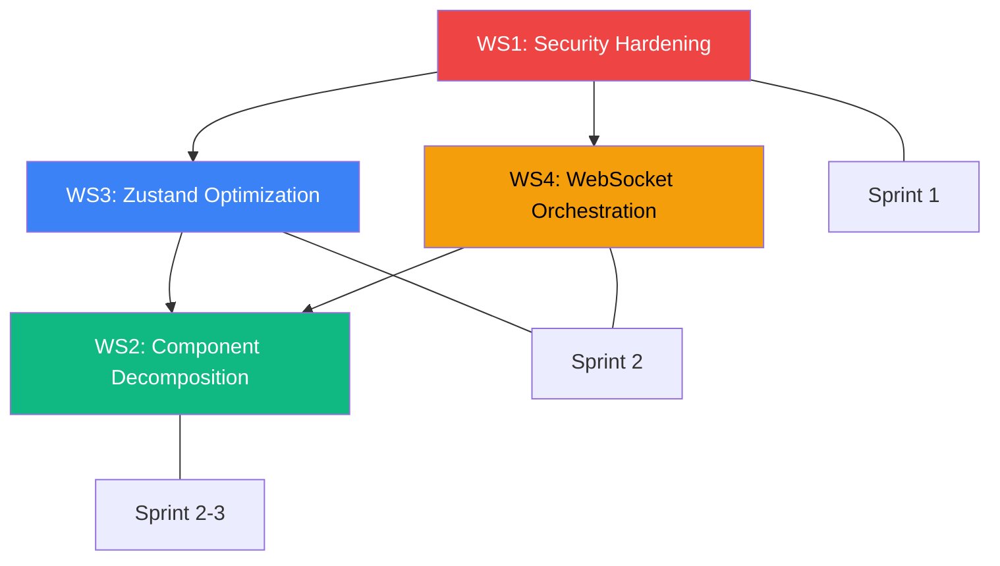

# Phase 4 Audit Report — UI Architecture Refactoring

> **Scope:** God Component Decomposition, Zustand Optimization, WebSocket Orchestration, Security Hardening  
> **Files:** `KanbanMain.jsx`, `CardDetailDrawer.jsx`, `boardSlice.js`, `cardSlice.js`, `useKanbanPermissions.js`  
> **Date:** 2026-04-27  
> **Status:** ✅ Complete  
> **Depends On:** Phase 3 Findings F3-01 through F3-28

---

## Executive Summary

Phase 4 translates the 28 findings from Phase 3 into **concrete, implementable refactoring actions** organized into 4 workstreams:

| Workstream | Findings Addressed | Estimated Effort |
|:-----------|:------------------:|:----------------:|
| WS1: Security Hardening | F3-01, F3-02, F3-08 | 4h |
| WS2: God Component Decomposition | F3-05, F3-06, F3-11, F3-20, F3-25 | 12h |
| WS3: Zustand Subscription Optimization | F3-04, F3-09, F3-13, F3-17 | 5h |
| WS4: WebSocket Orchestration | F3-03, F3-07, F3-15, F3-21 | 6h |
| **Total** | **16 findings** | **~27h** |

---

## WS1: Security Hardening (Sprint 1 — Immediate)

### WS1.1 — Remove All `'LE131'` Fallbacks (F3-01)

**Affected Files & Lines:**

| File | Line | Current Code |
|:-----|:----:|:-------------|
| `cardSlice.js` | 667 | `empNo \|\| 'LE131'` |
| `cardSlice.js` | 683 | `empNo \|\| 'LE131'` |
| `cardSlice.js` | 698 | `empNo \|\| 'LE131'` |
| `CardDetailDrawer.jsx` | 191 | `empNo \|\| 'LE131'` |
| `BoardSettingsDrawer.jsx` | 147 | `empNo \|\| 'LE131'` |

**Action — Replace all 5 occurrences with auth guard:**

```javascript
// cardSlice.js — fetchNotifications (L667)
fetchNotifications: async () => {
    const empNo = useAuthStore.getState().empNo;
    if (!empNo) {
        console.warn('[Auth] No authenticated user — skipping notification fetch');
        return [];
    }
    const res = await axios.get(server.KANBAN_NOTIFICATIONS, {
        params: { owner_u_code: empNo }
    });
    // ... rest unchanged
},

// cardSlice.js — markAllNotificationsRead (L683)
markAllNotificationsRead: async () => {
    const empNo = useAuthStore.getState().empNo;
    if (!empNo) return false;
    // ... rest unchanged
},

// cardSlice.js — markNotificationRead (L698)
markNotificationRead: async (id) => {
    const empNo = useAuthStore.getState().empNo;
    if (!empNo) return false;
    // ... rest unchanged
},
```

**CardDetailDrawer & BoardSettingsDrawer** — same pattern: remove fallback, add early return or disabled state.

### WS1.2 — Authenticated WebSocket Handshake (F3-02)

**Current (boardSlice.js L666-668):**
```javascript
const wsUrl = server.KANBAN_PROJECTS.replace('/api/kanban/projects', '');
const socket = io(wsUrl, { path: '/ws', transports: ['websocket', 'polling'] });
```

**Target:**
```javascript
connectWebSocket: (boardId, uCode) => {
    const auth = useAuthStore.getState();
    if (!auth.empNo || !auth.token) {
        console.error('[WS] Cannot connect — no authenticated session');
        return;
    }

    const existing = get().wsSocket;
    if (existing) {
        existing.emit('board:leave', existing._boardId);
        existing.emit('board:join', boardId);
        set({ wsBoardId: boardId, wsUserCode: uCode }); // WS1.3 fix
        return;
    }

    const wsUrl = server.KANBAN_PROJECTS.replace('/api/kanban/projects', '');
    const socket = io(wsUrl, {
        path: '/ws',
        transports: ['websocket', 'polling'],
        auth: { token: auth.token, uCode: auth.empNo }  // ← Auth token
    });

    socket.on('connect', () => {
        socket.emit('board:join', boardId);
        if (uCode) socket.emit('user:join', uCode);
    });

    // ... event handlers (see WS4)
    set({ wsSocket: socket, wsBoardId: boardId, wsUserCode: uCode });
},
```

**Server-side requirement:** The backend `websocket.js` must validate the token in the `board:join` handler before calling `socket.join(room)`.

### WS1.3 — Fix Permission Hook Missing Dependency (F3-08)

**File:** `useKanbanPermissions.js` L83

```diff
- }, [globalRole, isPrivateProject, projectRole, boardRole, cardRole, projectStatus]);
+ }, [globalRole, globalDepartment, isPrivateProject, projectRole, boardRole, cardRole, projectStatus]);
```

**Effort:** 5 minutes. **Impact:** Prevents stale permission cache when department changes.

---

## WS2: God Component Decomposition (Sprint 2-3)

### WS2.1 — CardDetailDrawer Decomposition Plan (F3-05)

**Current:** 2,469 LOC, 40+ local state variables, single file.

**Target Architecture:**

```
CardDetail/
├── CardDetailDrawer.jsx        ← Shell: drawer, header, layout (≈300 LOC)
├── sections/
│   ├── CardHeader.jsx           ← Title editing, status, priority
│   ├── CardDescription.jsx      ← Description + memo with rich text
│   ├── CardComments.jsx         ← Comment list, @mention parser, add form
│   ├── CardTaskLists.jsx        ← Task list CRUD, nested task items
│   ├── CardIssues.jsx           ← Problem/solution issue tracking
│   ├── CardAttachments.jsx      ← File/link upload, preview modal
│   ├── CardCustomFields.jsx     ← Custom field value editor
│   ├── CardTimeTracking.jsx     ← Lead/cycle time visualization
│   ├── CardDependencies.jsx     ← Parent/child card relationships
│   └── CardSidebar.jsx          ← Labels, members, dates, actions
├── hooks/
│   └── useCardDetailState.js    ← Shared state context for sub-components
└── AttachmentViewManager.jsx    ← (existing)
```

**State Distribution Strategy:**

| Sub-Component | State Variables to Extract | Store Subscriptions |
|:---|:---|:---|
| `CardHeader` | `editingName`, `editingMemo` | `updateCard` |
| `CardComments` | `commentText`, `editingCommentId` | `addComment`, `deleteComment`, `users` |
| `CardTaskLists` | `newTaskListName`, `newTaskNames`, `editingTaskId`, `editTaskName` | `createTaskList`, `updateTask` |
| `CardIssues` | `editingIssueId`, `editProblem`, `editSolution` | `createIssue`, `updateIssue` |
| `CardAttachments` | `linkUrl`, `linkName`, `isUploadingFile`, `previewAttachment` | `uploadAttachment`, `deleteAttachment` |
| `CardCustomFields` | `customFieldValues` | `fetchCustomFieldValues`, `upsertCustomFieldValue` |
| `CardTimeTracking` | `activityLog`, `showActivityLog` | `fetchCardActions` |
| `CardSidebar` | (none — uses parent props) | `labels`, `activeBoardMembers` |

**Shared Context Hook:**
```javascript
// hooks/useCardDetailState.js
import { createContext, useContext } from 'react';

const CardDetailContext = createContext(null);

export const CardDetailProvider = ({ cardId, cardDetail, children }) => {
    // Selective store subscriptions
    const { labels, activeBoardMembers, users } = useKanbanStore(
        useShallow(s => ({
            labels: s.labels,
            activeBoardMembers: s.activeBoardMembers,
            users: s.users
        }))
    );

    const value = { cardId, cardDetail, labels, activeBoardMembers, users };
    return (
        <CardDetailContext.Provider value={value}>
            {children}
        </CardDetailContext.Provider>
    );
};

export const useCardDetail = () => useContext(CardDetailContext);
```

**Refactored Shell (CardDetailDrawer.jsx ≈300 LOC):**
```jsx
const CardDetailDrawer = () => {
    const { isCardDetailOpen, activeCardDetail, closeCardDetail } = useKanbanStore(
        useShallow(s => ({
            isCardDetailOpen: s.isCardDetailOpen,
            activeCardDetail: s.activeCardDetail,
            closeCardDetail: s.closeCardDetail,
        }))
    );

    if (!isCardDetailOpen) return null;

    return (
        <Drawer open={isCardDetailOpen} onClose={closeCardDetail} width={800}>
            <CardDetailProvider cardId={activeCardDetail?.id} cardDetail={activeCardDetail}>
                <CardHeader />
                <CardDescription />
                <div style={{ display: 'flex', gap: 16 }}>
                    <div style={{ flex: 1 }}>
                        <CardTaskLists />
                        <CardIssues />
                        <CardAttachments />
                        <CardCustomFields />
                        <CardComments />
                    </div>
                    <CardSidebar />
                </div>
                <CardTimeTracking />
            </CardDetailProvider>
        </Drawer>
    );
};
```

### WS2.2 — KanbanMain Decomposition Plan (F3-06)

**Current:** 1,472 LOC with 3 inner components.

**Target Architecture:**

```
kanban/
├── KanbanMain.jsx              ← Entry: routing, project init (≈200 LOC)
├── ProjectListPage.jsx          ← Extracted from L152-423
├── BoardWorkspace.jsx           ← Board view shell (≈250 LOC)
├── BoardToolbar.jsx             ← Extracted from L426-852
├── BoardTabBar.jsx              ← Board tab navigation + DnD (≈150 LOC)
├── SortableBoardTab.jsx         ← Extracted from L921-951 (OUTSIDE component)
├── BoardGroupModal.jsx          ← Extracted from L1407-1466
└── ProjectMembersPopover.jsx    ← Extracted from L1160-1239
```

**Critical Fix — SortableBoardTab (F3-25):**

Move outside the component body to prevent identity thrashing:

```javascript
// SortableBoardTab.jsx — standalone file
import React, { memo } from 'react';
import { useSortable } from '@dnd-kit/sortable';
import { CSS } from '@dnd-kit/utilities';
import { BsKanban } from 'react-icons/bs';

const SortableBoardTab = memo(({ board, isActive, onSelect, theme }) => {
    const { attributes, listeners, setNodeRef, transform, transition, isDragging } =
        useSortable({ id: board.id });

    const style = {
        transform: CSS.Transform.toString(transform),
        transition,
        opacity: isDragging ? 0.5 : 1,
        zIndex: isDragging ? 10 : 1,
        padding: `${theme.spacing.sm} ${theme.spacing.lg}`,
        cursor: 'grab',
        borderBottom: isActive ? `2px solid ${theme.colors.primary}` : '2px solid transparent',
        color: isActive ? theme.colors.primary : theme.colors.textSecondary,
        fontWeight: isActive ? theme.typography.fontWeight.semibold : theme.typography.fontWeight.normal,
        fontSize: theme.typography.fontSize.sm,
        whiteSpace: 'nowrap',
        display: 'flex', alignItems: 'center', gap: 6,
    };

    return (
        <div ref={setNodeRef} style={style} {...attributes} {...listeners}
             onClick={() => onSelect(board)}>
            <BsKanban size={14} />
            {board.name}
        </div>
    );
});

export default SortableBoardTab;
```

**Fix `useKanbanStore.getState()` in Render (L1166-1227):**

The project members popover calls `useKanbanStore.getState()` directly in JSX. Replace with proper subscriptions:

```javascript
// ProjectMembersPopover.jsx
const ProjectMembersPopover = ({ projectId, theme }) => {
    const { projectManagers, users, addProjectManager, removeProjectManager } = useKanbanStore(
        useShallow(s => ({
            projectManagers: s.projectManagers,
            users: s.users,
            addProjectManager: s.addProjectManager,
            removeProjectManager: s.removeProjectManager,
        }))
    );
    // ... render with reactive data
};
```

### WS2.3 — Remove Dead Code (F3-11, F3-20)

**Duplicate Constants (F3-11):**
- Delete `GRADIENTS` (L52-61), `PROJECT_ICONS` (L64-101), `getProjectIcon` (L103-106) from `KanbanMain.jsx`
- Import from existing `kanbanConstants.js`

**Hidden Notification Bell (F3-20):**
- Delete L829-835 (the `display: none` wrapped notification badge)
- Remove `notifications`, `unreadNotificationCount`, `fetchNotifications`, `markAllNotificationsRead`, `markNotificationRead` from `BoardToolbar`'s store subscription since notification fetching happens elsewhere

---

## WS3: Zustand Subscription Optimization (Sprint 2)

### WS3.1 — Selective Subscription Migration (F3-04)

**Migration Pattern — Before/After:**

```javascript
// ❌ BEFORE — subscribes to ALL 78+ state keys
const { openCardDetail, labels, users, lists, cards } = useKanbanStore();

// ✅ AFTER — subscribes to exactly 5 keys
import { useShallow } from 'zustand/react/shallow';
const { openCardDetail, labels, users, lists, cards } = useKanbanStore(
    useShallow(s => ({
        openCardDetail: s.openCardDetail,
        labels: s.labels,
        users: s.users,
        lists: s.lists,
        cards: s.cards,
    }))
);
```

**Migration Checklist:**

| Component | File | Current Keys | Priority |
|:----------|:-----|:-------------|:--------:|
| `KanbanCard` | `KanbanCard.jsx:12` | `openCardDetail, labels, users, lists, cards` | 🔴 High (×80 instances) |
| `KanbanList` | `KanbanList.jsx:60` | 15+ keys | 🔴 High (×8 instances) |
| `BoardView` | `BoardView.jsx:61,438` | 20+ keys (2 subscriptions) | 🟠 High |
| `BoardToolbar` | `KanbanMain.jsx:427-434` | 18+ keys | 🟠 High |
| `KanbanMain` | `KanbanMain.jsx:861-868` | 16+ keys | 🟡 Medium |
| `ProjectListPage` | `KanbanMain.jsx:153-156` | 5 keys | 🟡 Medium |
| `CardDetailDrawer` | `CardDetailDrawer.jsx:125` | Full store | 🟡 Medium (addressed by WS2.1) |

**Impact Estimate:** For a board with 8 lists × 10 cards = 80 `KanbanCard` components, fixing `KanbanCard` alone eliminates ~80 unnecessary re-renders per state change.

### WS3.2 — Batch Preference Updates (F3-09)

**File:** `boardSlice.js` L353-376

```javascript
// ✅ AFTER — single set() call
fetchUserPreferences: async () => {
    try {
        const res = await axios.get(server.KANBAN_USER_PREFERENCES);
        const prefs = res.data?.data;
        if (!prefs) return;

        const updates = { userPreferences: prefs };
        if (prefs.kanban_tab_order) updates.kanbanTabOrder = prefs.kanban_tab_order;
        if (prefs.board_tab_orders) updates.boardTabOrders = prefs.board_tab_orders;
        if (prefs.cf_group_preferences) updates.cfGroupPreferences = prefs.cf_group_preferences;
        if (prefs.board_groups) updates.boardGroups = prefs.board_groups;
        if (prefs.active_board_group) updates.activeBoardGroup = prefs.active_board_group;

        set(updates); // ← Single render instead of 6
    } catch (err) {
        console.error('Failed to fetch user preferences', err);
    }
},
```

Apply the same to `updateUserPreferences` (L382-410).

### WS3.3 — Card Index Lookup Map (F3-13)

**Problem:** 7 functions do O(N×M) scans to find cards. Add an index:

```javascript
// In kanbanStore.js shared state:
cardIndex: new Map(),  // Map<cardId, listId>

// Helper to maintain the index:
_updateCardIndex: () => {
    const cards = get().cards;
    const index = new Map();
    for (const [listId, listCards] of Object.entries(cards)) {
        for (const card of listCards) {
            index.set(card.id, listId);
        }
    }
    set({ cardIndex: index });
},
```

Then replace all linear scans:
```javascript
// ❌ BEFORE
for (const [listId, listCards] of Object.entries(newCards)) {
    const idx = listCards.findIndex(c => c.id === cardId);
    if (idx >= 0) { /* ... */ break; }
}

// ✅ AFTER
const listId = get().cardIndex.get(cardId);
if (listId && newCards[listId]) {
    const idx = newCards[listId].findIndex(c => c.id === cardId);
    // ... direct access
}
```

### WS3.4 — Fix KanbanCard Store Subscription (F3-17)

Pass `parentCard` as a prop instead of subscribing to the entire `cards` object:

```javascript
// KanbanList.jsx — compute parentCard and pass down
const parentCard = card.parent_card_id
    ? Object.values(cards).flat().find(c => c.id === card.parent_card_id)
    : null;

<KanbanCard card={card} parentCard={parentCard} ... />

// KanbanCard.jsx — remove `cards` from store subscription
const { openCardDetail, labels: boardLabels, users, lists } = useKanbanStore(
    useShallow(s => ({
        openCardDetail: s.openCardDetail,
        labels: s.labels,
        users: s.users,
        lists: s.lists,
    }))
);
// Use parentCard from props instead of computing from store
```

---

## WS4: WebSocket Orchestration (Sprint 2)

### WS4.1 — Surgical Event Handlers (F3-03)

Replace full-board re-fetch with delta updates using the event payload:

```javascript
// boardSlice.js — connectWebSocket event handlers

// ── cardUpdate: patch the specific card in-place ──
socket.on('cardUpdate', (data) => {
    if (!data?.id) return;
    set(state => {
        const listId = state.cardIndex?.get(data.id);
        if (!listId || !state.cards[listId]) return state;

        const newCards = { ...state.cards };
        const idx = newCards[listId].findIndex(c => c.id === data.id);
        if (idx >= 0) {
            newCards[listId] = [...newCards[listId]];
            newCards[listId][idx] = { ...newCards[listId][idx], ...data };
        }

        const updates = { cards: newCards };
        if (state.activeCardDetail?.id === data.id) {
            updates.activeCardDetail = { ...state.activeCardDetail, ...data };
        }
        return updates;
    });
});

// ── cardCreate: append to the target list ──
socket.on('cardCreate', (data) => {
    if (!data?.id || !data?.list_id) return;
    set(state => {
        const newCards = { ...state.cards };
        const listCards = newCards[data.list_id] || [];
        // Avoid duplicates
        if (!listCards.find(c => c.id === data.id)) {
            newCards[data.list_id] = [...listCards, data];
        }
        return { cards: newCards };
    });
});

// ── cardDelete: remove from the source list ──
socket.on('cardDelete', (data) => {
    if (!data?.id) return;
    set(state => {
        const newCards = { ...state.cards };
        for (const [listId, listCards] of Object.entries(newCards)) {
            const idx = listCards.findIndex(c => c.id === data.id);
            if (idx >= 0) {
                newCards[listId] = listCards.filter(c => c.id !== data.id);
                break;
            }
        }
        return { cards: newCards };
    });
});

// ── commentCreate/Update: only refresh the open card ──
socket.on('commentCreate', (data) => {
    if (data?.item?.card_id && get().activeCardDetail?.id === data.item.card_id) {
        get().fetchCardDetail(data.item.card_id);
    }
});
```

**Backend Requirement:** WebSocket events must include the full card payload (not just IDs) for surgical updates to work. If the backend currently only sends `{ id }`, it must be updated to send `{ id, name, list_id, ... }`.

### WS4.2 — Proper Cleanup on Board Transitions (F3-07)

```javascript
// KanbanMain.jsx — replace the empty cleanup
useEffect(() => {
    if (activeBoard?.id) {
        connectWebSocket(activeBoard.id, empNo);
    }
    return () => {
        // Remove all event handlers from the current socket
        const socket = useKanbanStore.getState().wsSocket;
        if (socket) {
            socket.off('cardUpdate');
            socket.off('cardCreate');
            socket.off('cardDelete');
            socket.off('listUpdate');
            socket.off('commentCreate');
            socket.off('commentUpdate');
            socket.off('commentDelete');
            socket.off('notificationCreate');
        }
    };
}, [activeBoard?.id, empNo, connectWebSocket]);

// Remove the separate disconnectWebSocket useEffect (L1070-1072)
// and add disconnect to the same cleanup:
useEffect(() => {
    return () => disconnectWebSocket();
}, []); // Only on full unmount
```

### WS4.3 — Disconnect WebSocket on Project Switch (F3-15)

```javascript
// projectSlice.js — setActiveProject
setActiveProject: (project) => {
    const currentProject = get().activeProject;
    if (currentProject?.id === project?.id) return;

    // Disconnect WebSocket before clearing state
    get().disconnectWebSocket();

    set({
        activeProject: project,
        activeBoard: null,
        boards: [],
        lists: [],
        cards: {},
        activeBoardMembers: [],
        // ...
    });

    if (project?.id) {
        get().fetchBoards(project.id);
        get().fetchProjectManagers(project.id);
    }
},
```

### WS4.4 — Store WebSocket Metadata in Zustand (F3-21)

Replace socket mutation with proper state:

```diff
// boardSlice.js state
  wsSocket: null,
+ wsBoardId: null,
+ wsUserCode: null,

// connectWebSocket — replace socket._boardId mutations:
- socket._boardId = boardId;
- socket._uCode = uCode;
+ set({ wsBoardId: boardId, wsUserCode: uCode });

// When reconnecting existing socket:
  const existing = get().wsSocket;
  if (existing) {
-     existing.emit('board:leave', existing._boardId);
+     existing.emit('board:leave', get().wsBoardId);
      existing.emit('board:join', boardId);
-     existing._boardId = boardId;
+     set({ wsBoardId: boardId });
  }
```

---

## Dependency Graph



**Rationale:** Security (WS1) is prerequisite because the WebSocket auth token pattern (WS1.2) must be in place before rewriting event handlers (WS4). Zustand optimizations (WS3) should be done before component decomposition (WS2) so the new sub-components start with correct subscription patterns.

---

## Sprint Execution Plan

### Sprint 1 — Security (4h)

| Task | Finding | Effort | Risk |
|:-----|:--------|:------:|:----:|
| Remove all `'LE131'` fallbacks | F3-01 | 1h | 🔴 Critical |
| Add auth token to WS handshake | F3-02 | 2.5h | 🔴 Critical |
| Fix permission hook deps | F3-08 | 15min | 🟠 High |
| Add auth guard to `connectWebSocket` | F3-02 | 15min | 🔴 Critical |

### Sprint 2 — Performance (11h)

| Task | Finding | Effort | Risk |
|:-----|:--------|:------:|:----:|
| Surgical WS event handlers | F3-03 | 4h | 🟠 High |
| WS cleanup on board transition | F3-07 | 1h | 🟠 High |
| Disconnect WS on project switch | F3-15 | 15min | 🟡 Medium |
| Store WS metadata in state | F3-21 | 30min | 🔵 Low |
| Convert all store subscriptions to `useShallow` | F3-04 | 3h | 🟠 High |
| Batch preference `set()` calls | F3-09 | 30min | 🟠 High |
| Add card index lookup map | F3-13 | 1h | 🟡 Medium |
| Fix KanbanCard `cards` subscription | F3-17 | 45min | 🟡 Medium |

### Sprint 3 — Architecture (12h)

| Task | Finding | Effort | Risk |
|:-----|:--------|:------:|:----:|
| Extract `CardDetailDrawer` sub-components | F3-05 | 8h | 🟠 High |
| Extract `SortableBoardTab`, `ProjectListPage`, `BoardToolbar` | F3-06 | 3h | 🟠 High |
| Deduplicate constants imports | F3-11 | 15min | 🟡 Medium |
| Remove hidden notification bell | F3-20 | 15min | 🟡 Medium |
| Extract `_applyPreferences` helper | F3-16 | 30min | 🟡 Medium |

---

## Verification Checklist

After implementation, verify:

- [ ] No `'LE131'` string exists anywhere in the frontend codebase
- [ ] WebSocket connections include auth token in handshake
- [ ] Board switching triggers proper WS listener cleanup (no stale handlers)
- [ ] Project switching disconnects WebSocket before state reset
- [ ] `useKanbanStore()` is never called without a selector in components with many instances
- [ ] `CardDetailDrawer.jsx` is under 400 LOC
- [ ] `KanbanMain.jsx` is under 300 LOC
- [ ] No component definitions exist inside other component bodies
- [ ] `useKanbanStore.getState()` is never used inside JSX render paths
- [ ] `useKanbanPermissions` memo dependencies include `globalDepartment`

---

> [!IMPORTANT]
> **Sprint 1 (Security) is a hard prerequisite for all other work.** The LE131 fallback and unauthenticated WebSocket are active vulnerabilities that must be resolved first. Do not begin performance or architecture work until WS1 is merged and deployed.
