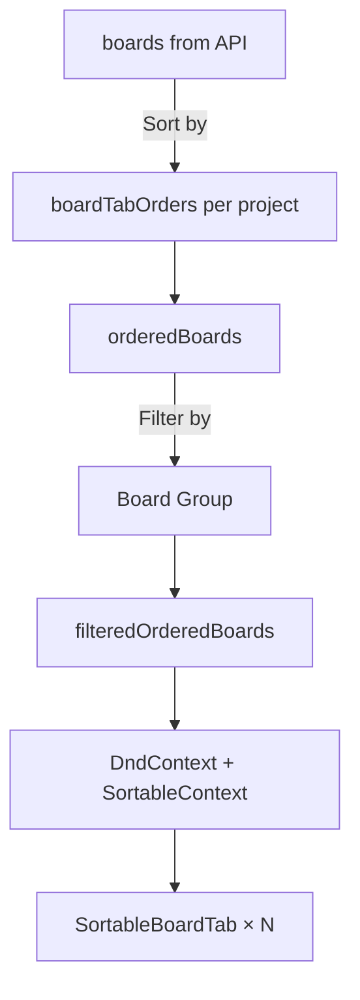

# Verification & Regression Audit Report
**Date:** 2026-04-27 | **Auditor:** Antigravity AI

---

## Part 1: Original Issue Verification Matrix

| # | Finding | Pattern | Verdict | Details |
|---|---------|---------|---------|---------|
| 1 | **Hardcoded `'LE131'` fallbacks** | `'LE131'` as default user | ❌ **FAIL** | **26+ live instances remain.** All in backend: [kanban_card.js](file:///d:/97_Projects/00_System/EngineerSystem/apps/ENG-Backend/api/kanban/kanban_card.js) (18 occurrences), [kanban_extra.js](file:///d:/97_Projects/00_System/EngineerSystem/apps/ENG-Backend/api/kanban/kanban_extra.js) (2), [kanban_issue.js](file:///d:/97_Projects/00_System/EngineerSystem/apps/ENG-Backend/api/kanban/kanban_issue.js) (3). Each endpoint has `req.user?.empno || ... || 'LE131'`. |
| 2 | **WebSocket lacks JWT auth** | Unauthenticated WS handshake | ✅ **PASS** | [boardSlice.js:657](file:///d:/97_Projects/00_System/EngineerSystem/apps/ENG-Frontend/src/components/engineer/kanban/store/boardSlice.js#L657) now sends `auth: { token: authToken, empNo }`. Auth guard at [L632-636](file:///d:/97_Projects/00_System/EngineerSystem/apps/ENG-Frontend/src/components/engineer/kanban/store/boardSlice.js#L632-L636) refuses connection if no authenticated user. |
| 3 | **`engPool.connect()` missing `finally/release`** | Connection pool leak | ⚠️ **PARTIAL PASS** | `kanban_card.js`: 20 connects, 16 finally blocks — **4 discrepancies** due to early-return `client.release()` inside `catch`/conditional blocks (e.g. [L410](file:///d:/97_Projects/00_System/EngineerSystem/apps/ENG-Backend/api/kanban/kanban_card.js#L410)). While not actual leaks (the `finally` covers the main path), these are anti-patterns. `kanban_board.js`, `kanban_project.js`, `kanban_extra.js`: All properly wrapped. |
| 4 | **SQL injection via dynamic table name** | `getNextPosition` interpolation | ✅ **PASS** | `ALLOWED_TABLES` whitelist implemented at [kanban_board.js:17](file:///d:/97_Projects/00_System/EngineerSystem/apps/ENG-Backend/api/kanban/kanban_board.js#L17). All calls use whitelisted keys (`'kb_board'`, `'kb_list'`, `'kb_label'`). Unknown keys throw. |
| 5 | **`useKanbanStore()` without `useShallow`** | Full-store re-renders | ❌ **FAIL** | **8 components** still call `useKanbanStore()` without `useShallow`: [KanbanMain.jsx:102](file:///d:/97_Projects/00_System/EngineerSystem/apps/ENG-Frontend/src/components/engineer/kanban/KanbanMain.jsx#L102), [L380](file:///d:/97_Projects/00_System/EngineerSystem/apps/ENG-Frontend/src/components/engineer/kanban/KanbanMain.jsx#L380), [L814](file:///d:/97_Projects/00_System/EngineerSystem/apps/ENG-Frontend/src/components/engineer/kanban/KanbanMain.jsx#L814), [useCardDetailState.js:68](file:///d:/97_Projects/00_System/EngineerSystem/apps/ENG-Frontend/src/components/engineer/kanban/CardDetail/useCardDetailState.js#L68), [ProjectSettingsDrawer.jsx:135](file:///d:/97_Projects/00_System/EngineerSystem/apps/ENG-Frontend/src/components/engineer/kanban/Settings/ProjectSettingsDrawer.jsx#L135), [BoardSettingsDrawer.jsx:108](file:///d:/97_Projects/00_System/EngineerSystem/apps/ENG-Frontend/src/components/engineer/kanban/Settings/BoardSettingsDrawer.jsx#L108), [WorkloadDashboard.jsx:79](file:///d:/97_Projects/00_System/EngineerSystem/apps/ENG-Frontend/src/components/engineer/kanban/Workload/WorkloadDashboard.jsx#L79), [ReportDashboard.jsx:24](file:///d:/97_Projects/00_System/EngineerSystem/apps/ENG-Frontend/src/components/engineer/kanban/Reports/ReportDashboard.jsx#L24). The mapped/list-rendered components (`KanbanCard`, `KanbanList`, `BoardView`) **are correctly using `useShallow`**. |
| 6 | **Monolithic `CardDetailDrawer.jsx`** | 2469-line God Component | ✅ **PASS** | Successfully decomposed into 6 files: [CardDetailDrawer.jsx](file:///d:/97_Projects/00_System/EngineerSystem/apps/ENG-Frontend/src/components/engineer/kanban/CardDetail/CardDetailDrawer.jsx) (124 lines), [useCardDetailState.js](file:///d:/97_Projects/00_System/EngineerSystem/apps/ENG-Frontend/src/components/engineer/kanban/CardDetail/useCardDetailState.js) (636 lines), [CardHeader.jsx](file:///d:/97_Projects/00_System/EngineerSystem/apps/ENG-Frontend/src/components/engineer/kanban/CardDetail/CardHeader.jsx), [CardBody.jsx](file:///d:/97_Projects/00_System/EngineerSystem/apps/ENG-Frontend/src/components/engineer/kanban/CardDetail/CardBody.jsx), [CardSidebar.jsx](file:///d:/97_Projects/00_System/EngineerSystem/apps/ENG-Frontend/src/components/engineer/kanban/CardDetail/CardSidebar.jsx), [CardComments.jsx](file:///d:/97_Projects/00_System/EngineerSystem/apps/ENG-Frontend/src/components/engineer/kanban/CardDetail/CardComments.jsx), [CardTaskLists.jsx](file:///d:/97_Projects/00_System/EngineerSystem/apps/ENG-Frontend/src/components/engineer/kanban/CardDetail/CardTaskLists.jsx). |

### Score: 3 PASS / 1 PARTIAL / 2 FAIL

---

## Part 2: Regression Checklist — New Issues

### 🔴 P0 — Critical (Data Consistency)

#### R-01: `cardIndex` Stale After `deleteList`
**File:** [boardSlice.js:232-245](file:///d:/97_Projects/00_System/EngineerSystem/apps/ENG-Frontend/src/components/engineer/kanban/store/boardSlice.js#L232-L245)

`deleteList` removes `cards[listId]` from state but does **not** remove those card IDs from `cardIndex`. After deleting a list, the index still maps those card IDs to a non-existent list, causing `_findCardList()` to return stale data.

```diff
 deleteList: async (listId) => {
     try {
         await axios.delete(`${server.KANBAN_LISTS}/${listId}`);
-        set(state => ({
-            lists: state.lists.filter(l => l.id !== listId),
-            cards: (() => { const c = { ...state.cards }; delete c[listId]; return c; })()
-        }));
+        set(state => {
+            const newCards = { ...state.cards };
+            const removedCards = newCards[listId] || [];
+            delete newCards[listId];
+            // F3-13: Clean index entries for removed cards
+            const newIndex = new Map(state.cardIndex);
+            removedCards.forEach(c => newIndex.delete(String(c.id)));
+            return {
+                lists: state.lists.filter(l => l.id !== listId),
+                cards: newCards,
+                cardIndex: newIndex,
+            };
+        });
         return true;
```

---

#### R-02: `cardIndex` Stale After `sortListCards`
**File:** [boardSlice.js:318-332](file:///d:/97_Projects/00_System/EngineerSystem/apps/ENG-Frontend/src/components/engineer/kanban/store/boardSlice.js#L318-L332)

`sortListCards` replaces `cards[listId]` with a fresh array from the API. Since the card IDs haven't changed (only order), the existing index entries are still valid. However, if the backend ever changes card IDs during sort or adds/removes cards, the index will be stale. **Low risk but should call `_rebuildCardIndex`** for consistency.

```diff
 if (res.data?.data) {
     set(state => ({
         cards: { ...state.cards, [listId]: res.data.data }
     }));
+    get()._rebuildCardIndex();
 }
```

---

### 🟡 P1 — High (Performance / Reactivity)

#### R-03: `useCardDetailState.js` Lies About `useShallow`
**File:** [useCardDetailState.js:13-14](file:///d:/97_Projects/00_System/EngineerSystem/apps/ENG-Frontend/src/components/engineer/kanban/CardDetail/useCardDetailState.js#L13-L14) and [L68](file:///d:/97_Projects/00_System/EngineerSystem/apps/ENG-Frontend/src/components/engineer/kanban/CardDetail/useCardDetailState.js#L68)

The doc comment says it "Uses useKanbanStore with useShallow" but line 68 calls `useKanbanStore()` **without** `useShallow`. Since the Provider mounts once and pipes through context, any unrelated store slice change (e.g., `notifications`, `searchQuery`) will re-render the entire CardDetailDrawer tree. The `useMemo` on context `value` is also **missing**, so every Provider render creates a new object reference, cascading re-renders to all 6 sub-components.

> [!WARNING]
> **Impact:** Every Zustand state change (even in unrelated slices) triggers a full re-render of the entire card detail drawer and all 6 sub-components.

**Fix:** Wrap the store call with `useShallow` and memoize the context value.

---

#### R-04: Dead `socket.off('cardCreate')` and `socket.off('cardDelete')` in Cleanup
**File:** [KanbanMain.jsx:988-989](file:///d:/97_Projects/00_System/EngineerSystem/apps/ENG-Frontend/src/components/engineer/kanban/KanbanMain.jsx#L988-L989)

We removed the `cardCreate`/`cardDelete` listeners from `boardSlice.js`, but the cleanup effect in `KanbanMain.jsx` still calls `socket.off('cardCreate')` and `socket.off('cardDelete')`. While harmless (no-op), it's dead code that creates confusion.

---

#### R-05: `useKanbanStore.getState()` Called Inside Render (Anti-Pattern)
**File:** [KanbanMain.jsx:1096, 1108, 1116, 1136, 1137, 1154](file:///d:/97_Projects/00_System/EngineerSystem/apps/ENG-Frontend/src/components/engineer/kanban/KanbanMain.jsx#L1096)

Multiple `useKanbanStore.getState()` calls inside the Project Members popover's render function. These bypass React's reactivity system — if `projectManagers` or `users` changes while the popover is open, it **will NOT re-render** to reflect the change.

---

### 🟢 P2 — Low (Cleanup / Hygiene)

#### R-06: Double `client.release()` Anti-Pattern
**File:** [kanban_card.js:410](file:///d:/97_Projects/00_System/EngineerSystem/apps/ENG-Backend/api/kanban/kanban_card.js#L410)

```js
if (updateFields.length === 0) {
    await client.query('ROLLBACK');
    client.release();   // ← Redundant: the finally block at L440 also calls release()
    return res.json({ data: card });
}
```

In the early-return path, `client.release()` is called explicitly, then `finally { client.release() }` at L440 calls it again. With Node.js `pg` pool this usually triggers a warning but doesn't crash. Should be removed — let `finally` handle it.

---

#### R-07: Context Value Not Memoized
**File:** [useCardDetailState.js:544-626](file:///d:/97_Projects/00_System/EngineerSystem/apps/ENG-Frontend/src/components/engineer/kanban/CardDetail/useCardDetailState.js#L544-L626)

The massive `value` object is recreated on every render. Since it contains ~100+ fields and all handler functions are not wrapped in `useCallback`, every state change in the Provider creates a new context value, forcing all 6 consumers to re-render.

---

#### R-08: `useKanbanStore.getState()` Used to Read `users` in popoverRender
**File:** [KanbanMain.jsx:1116](file:///d:/97_Projects/00_System/EngineerSystem/apps/ENG-Frontend/src/components/engineer/kanban/KanbanMain.jsx#L1116)

Reading `users` from `getState()` inside `popupRender` means the user list is fetched at render time but will NOT auto-refresh if a new user is added while the popover is open.

---

## Part 3: Board Tab System Deep Analysis

### Current Architecture



### Current Data Flow

| Layer | Source | Description |
|---|---|---|
| **Original Order** | `boards` array from API | Sorted by `position` column from backend |
| **Custom Order** | `boardTabOrders[projectId]` | User-defined via drag-and-drop, persisted in `kb_user_preferences` |
| **Board Groups** | `boardGroups[projectId]` | Named subsets with `boardIds[]` filter + `auto_open` flag |
| **Rendered** | `filteredOrderedBoards` | Custom order → Group filter → `SortableBoardTab` components |

### Problem: No Way to See "Original" Order

Currently, when a user drags board tabs, the custom order is saved permanently. There is **no UI to toggle back** to the backend's original position order, nor to "reset" the custom order. The user experience has three gaps:

1. **Irreversible:** Once you drag, you can never see the original backend order again
2. **No visual indicator:** Users can't tell if they're looking at a custom arrangement or the default
3. **Shared confusion:** Custom order is per-user, so users may refer to different board positions in team discussions

### Proposed Solution: Original/Custom Toggle

#### UI Design

Add a small toggle button next to the Board Group dropdown:

```
[+ ] [🔍 Board Group ▼] [⇅ Custom ▼]  [Board1] [Board2] [Board3] ...
                                  ↓ click
                          ┌──────────────────┐
                          │ ● Custom Order   │ ← current drag order
                          │ ○ Original Order │ ← backend position
                          │ ─────────────────│
                          │ 🔄 Reset Custom  │ ← deletes saved order
                          └──────────────────┘
```

#### Implementation Plan

##### Frontend: [KanbanMain.jsx](file:///d:/97_Projects/00_System/EngineerSystem/apps/ENG-Frontend/src/components/engineer/kanban/KanbanMain.jsx)

1. Add `useOriginalOrder` local state (per-project, default: `false`)
2. Modify `orderedBoards` memo to respect the toggle:
```js
const orderedBoards = useMemo(() => {
    if (!boards || !activeProject) return [];
    if (useOriginalOrder) return boards; // ← API order (by position)
    
    const order = boardTabOrders?.[activeProject.id];
    if (!order || order.length === 0) return boards;
    return [...boards].sort((a, b) => {
        const idxA = order.indexOf(a.id);
        const idxB = order.indexOf(b.id);
        if (idxA === -1 && idxB === -1) return 0;
        if (idxA === -1) return 1;
        if (idxB === -1) return -1;
        return idxA - idxB;
    });
}, [boards, boardTabOrders, activeProject, useOriginalOrder]);
```

3. Disable drag-and-drop when `useOriginalOrder` is true (no sense dragging if it won't persist)
4. Add a "Reset Custom Order" action that deletes `boardTabOrders[projectId]`

##### Store: [kanbanStore.js](file:///d:/97_Projects/00_System/EngineerSystem/apps/ENG-Frontend/src/components/engineer/kanban/store/kanbanStore.js)

Add `resetBoardTabOrder` action:
```js
resetBoardTabOrder: async (projectId) => {
    const current = get().boardTabOrders;
    const { [projectId]: _, ...rest } = current;
    set({ boardTabOrders: rest });
    await get().updateUserPreferences({ board_tab_orders: rest });
},
```

> [!IMPORTANT]
> **Key Decision Required:** Should "Original Order" be the static backend `position` column, or should it be dynamically derived from creation date? The current API already sorts by `position`, which admins can change via the board settings reorder endpoint. If "original" means "admin-defined canonical order", then using `boards` as-is (API response) is correct.
