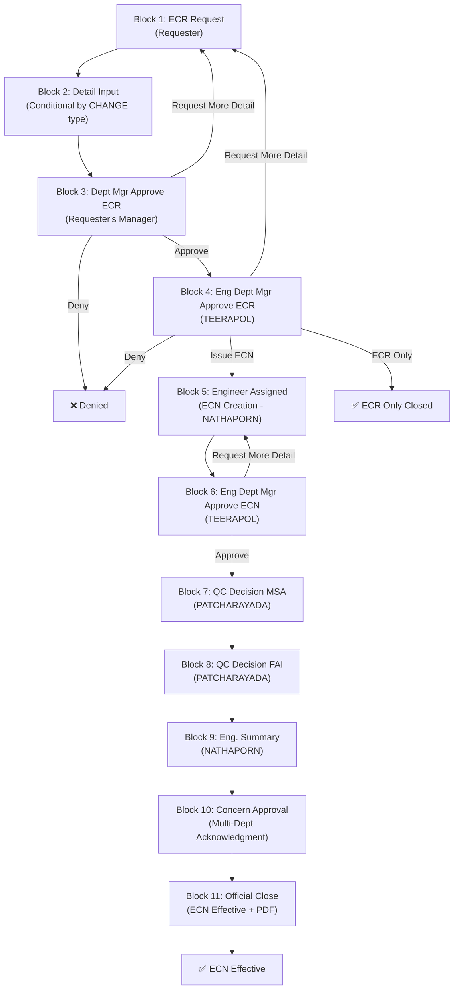

# ECR/ECN Approval Workflow System (ECNT) — Implementation Plan

## Background & Context

Based on my analysis of [Requirement.md](file:///d:/97_Projects/00_System/ECNT/Source/Requirement.md) and the visual flowchart in [Detail for system.xlsx](file:///d:/97_Projects/00_System/ECNT/Source/Detail%20for%20system.xlsx), this system is a **multi-stage engineering change approval workflow** used in a manufacturing environment (Glugent). The workflow governs the lifecycle of **ECR (Engineering Change Requests)** and **ECN (Engineering Change Notices)** through 11 distinct blocks with conditional branching.

> [!IMPORTANT]
> I notice your existing Engineering System (ES) already has **Phases 9–16** implementing an ECR/ECN workflow with React, Ant Design, Express.js, and PostgreSQL. This new ECNT project appears to be either a **standalone rebuild** or a **next-generation replacement**.

## User Review Required

> [!WARNING]
> **Critical Decision: Standalone vs. Integration**
> 
> Your existing ES already has a mature ECR/ECN engine (Phases 9-16) with 16+ workflow steps, RBAC, PDF export, file uploads, and email notifications. Before proceeding, please clarify:
> 
> 1. **Standalone New System** — Build ECNT as a completely independent application following the tech stack in Requirement.md (React + Tailwind + Ant Design, Express/FastAPI, PostgreSQL, Docker)?
> 2. **Replacement/V2 of Existing** — Rebuild the ECR/ECN module within the existing ES codebase using the new detailed flowchart as the specification?
> 3. **Fork & Modernize** — Fork the existing ES ECR/ECN module into a new standalone service, then refactor it to match the new flowchart?

## Open Questions

> [!IMPORTANT]
> 1. **Backend Framework**: Requirement.md lists both Node.js (Express) and Python (FastAPI/Flask). Which do you prefer? Given your existing ES uses Express.js, I'd recommend **Express.js** for consistency unless there's a reason to switch.
> 
> 2. **Tailwind CSS**: Requirement.md specifies Tailwind CSS + Ant Design. Your existing ES uses vanilla CSS + Ant Design with a custom Vibrant Pastel theme system. Should we use Tailwind (as specified) or follow the existing ES pattern?
> 
> 3. **Authentication**: Should this use the existing ES JWT-based auth system, or do you need a new standalone authentication mechanism (e.g., AD/LDAP integration, Google OAuth)?
> 
> 4. **Google Doc Reference**: The spreadsheet references a Google Doc (`ECN FOR GLUGENT 2025`). Does this document contain additional specifications that should be incorporated?

---

## Workflow Analysis (from Excel Flowchart)

Based on the extracted images and shape annotations, I've reconstructed the complete 11-block workflow:

### Block-by-Block Flow

| Block | Title | Actor | Actions |
|-------|-------|-------|---------|
| **1** | ECR Request (Initiation) | Requester (Dept Mgr/Section Head/JP Member) | Fill form: Reference No., Request By, Date, Department, **STATUS** (Permanent/Temporary), **OBJECTIVE** (Reduce Cycle/Cost Reduction/Increase Usage Tooling/Improve Yield/Other), **CHANGE** (Product/Process Drawing, Tooling, Program, Usage) |
| **2** | Requester Detail Input | Requester | Conditional sub-forms based on CHANGE type: **Drawing** → Part No., C/N, Revision, Before/After change with attachments; **Tooling** → Current/New Tooling No., Usage (K/pc); **Program** → Cutting Program & Condition Before/After with attachments; **Usage** → Setup data sheet Before/After |
| **3** | Requester's Dept Manager Approve ECR | Department Manager | **Approve** → Block 3; **Request More Detail** → auto-mail requester, return to Block 1; **Deny** → terminal with reason |
| **4** | Engineer Dept Manager Approve ECR | Eng. Dept. Mgr (TEERAPOL) | **Request More Detail** → return to Block 1; **Approve** → assign ECR No. (YYMMxx auto), choose **Issue ECN** → Block 5 or **ECR Only** → close by category; **Deny** → terminal |
| **5** | Engineer Assigned (ECN Creation) | Eng. Assigned (NATHAPORN) | Confirm DWG Suspend, input ECN No. (manual), carry over ECR data, fill: Title of Change, Reason, Scope, Before/After with attachments, **Impact Assessment** (Customer, KZW/FJSW, Sale Drawing), **Affected Areas** checklist (Traceability, WIP/Stock, Outsourcing, Unit Price, Manufacturing, Product Quality, Safety, On-Time Delivery), input related models |
| **6** | Engineer Dept Manager Approve ECN | Eng. Dept. Mgr (TEERAPOL) | **Approve** → Block 7; **Request More Detail** → return to Block 5; Start revise and update drawing/documents |
| **7** | QC Decision for MSA | QC (PATCHARAYADA) | MSA Require / MSA Not Require with reason and attachments |
| **8** | QC Decision for FAI | QC (PATCHARAYADA) | Require ΔFAI / Require Full FAI / FAI Not Require with reason and attachments |
| **9** | Engineer Assigned Summary | Eng. Assigned (NATHAPORN) | Confirm FAI Approved (if required), FAI Lot No., Summary of FAI result, Stakeholder Comment/action with attachments |
| **10** | Concern Approval (Multi-Department) | Multiple Departments | Eng. Assigned selects NEED/NO NEED for each: **PC** (TASANEE), **QA** (CHUANPIT), **QC** (SUPARAT), **PD1** (CHANASORN), **PD2** (WATCHARIYA), **MC** (PUSSADEE), **MM** (Sarunyu). Each acknowledges with sign-off and date. Also: Confirm DWG Enable |
| **11** | Official Close (ECN Effective) | Eng. Dept. Mgr (TEERAPOL) | Officially close ECN by, Officially close Date → **Generate PDF** |

### Decision Flow Diagram



### Master Person In-Charge

| Role | Person |
|------|--------|
| Eng. Dept Mgr | TEERAPOL KANTAPOOM |
| Eng. Assigned | NATHAPORN YAMMANUS |
| QC Decision for FAI | PATCHARAYADA WAIYABOON |
| PC | TASANEE CHUDUANG |
| QA | CHUANPIT KHATTIYA |
| QC | SUPARAT KATSANUK |
| Production #1 | CHANASORN MEEPRO |
| Production #2 | WATCHARIYA ROEKARAM |
| MC | PUSSADEE ROIKEAW |
| MM | Sarunyu Chokchaikasemsuk |
| Thai Manager/Div. Head | Sakda Tantidechamongkol |
| Japanese Manager | Ryoichi Furuta |
| Requester | Dept Manager / Section Head Process / Japanese Member |

---

## Proposed Changes

Following the phased approach outlined in Requirement.md:

### Phase 1: Architecture & Database Design

#### [NEW] `docs/architecture.md`
- System architecture diagram (React SPA → Express API → PostgreSQL)
- Component breakdown and data flow
- Authentication & authorization strategy

#### [NEW] `database/schema.sql`
PostgreSQL schema covering:

```sql
-- Core Tables
users                -- id, u_code, full_name, email, department, position, role, is_active
roles                -- id, role_name, description, permissions (JSONB)
user_roles           -- user_id, role_id (M:N)

-- Document Tables
ecr_documents        -- id, ecr_no (YYMMxx auto), requester_id, department,
                     -- status (PERMANENT/TEMPORARY), objective, change_type,
                     -- process_status, current_block, created_at, updated_at

ecn_documents        -- id, ecn_no (manual by Eng), ecr_id (FK),
                     -- engineer_assigned_id, title_of_change, reason_of_change,
                     -- scope_of_implementation, dwg_suspended, dwg_enabled,
                     -- process_status, current_block, created_at, updated_at

-- Block-Specific Data (JSONB for flexibility)
ecr_request_data     -- id, ecr_id, block_number, data (JSONB), attachments
ecn_detail_data      -- id, ecn_id, block_number, section, data (JSONB), attachments

-- Change Type Sub-forms
change_drawing       -- ecr_id, part_no, cn, revision, before_change, after_change
change_tooling       -- ecr_id, current_tooling_no, new_tooling_no, usage_kpc_current, usage_kpc_new
change_program       -- ecr_id, before_program, after_program
change_usage         -- ecr_id, before_setup, after_setup

-- Impact Assessment
impact_assessment    -- ecn_id, customer_name, customer_impact, 4m_request_doc_no,
                     -- notification_date, change_notice_date, cust_approved_date,
                     -- kzw_fjsw_impact, operation_type, sale_drawing_impact

-- Affected Areas Checklist
affected_areas       -- ecn_id, traceability, wip_stock, outsourcing, unit_price,
                     -- manufacturing_process, product_quality, safety, on_time_delivery
                     -- (each with sub-fields as JSONB)

-- Workflow State Machine
workflow_states      -- id, document_type (ECR/ECN), document_id,
                     -- from_block, to_block, action (APPROVE/DENY/RMD),
                     -- actor_id, comment, created_at

-- Approval Logs
approval_logs        -- id, document_type, document_id, block_number, step_name,
                     -- action, actor_id, actor_name, comment, deny_reason,
                     -- request_to_requester, details (JSONB), created_at

-- Multi-Department Acknowledgment (Block 10)
concern_approvals    -- id, ecn_id, department (PC/QA/QC/PD1/PD2/MC/MM),
                     -- is_needed, approver_id, approved_by, approved_date, status

-- QC Decisions
qc_decisions         -- id, ecn_id, decision_type (MSA/FAI), decision (REQUIRE/NOT_REQUIRE),
                     -- fai_type (DELTA/FULL), reason, attachments, confirmed_by, confirmed_date

-- FAI Summary (Block 9)
fai_summaries        -- id, ecn_id, fai_lot_no, summary_result, stakeholder_comment,
                     -- fai_approved_confirmed, confirmed_by, confirmed_date

-- File Attachments
attachments          -- id, document_type, document_id, block_number, section,
                     -- file_name, file_path, file_type, file_size, uploaded_by, created_at

-- Email Notifications Log
notification_logs    -- id, document_type, document_id, recipient_id, email_type,
                     -- subject, body, sent_at, status

-- System Audit
system_logs          -- id, action, actor_id, entity_type, entity_id,
                     -- old_value (JSONB), new_value (JSONB), created_at
```

### Phase 2: Backend Setup & API Development

#### [NEW] `backend/` directory structure
```
backend/
├── server.js                    # Express app entry
├── .env                         # Environment config
├── config/
│   └── database.js              # PostgreSQL connection pool
├── middleware/
│   ├── auth.js                  # JWT authentication
│   └── rbac.js                  # Role-based access control
├── routes/
│   ├── auth.js                  # Login, register, token refresh
│   ├── ecr.js                   # ECR CRUD + workflow transitions
│   ├── ecn.js                   # ECN CRUD + workflow transitions  
│   ├── upload.js                # File upload handling
│   └── users.js                 # User management
├── controllers/
│   ├── authController.js
│   ├── ecrController.js         # Block 1-4 logic
│   ├── ecnController.js         # Block 5-11 logic
│   └── workflowEngine.js        # State machine transitions
├── services/
│   ├── emailService.js          # Auto-email on status change
│   ├── pdfService.js            # PDF generation at Block 11
│   └── numberingService.js      # ECR No. (YYMMxx) auto-generation
└── utils/
    └── validators.js
```

**Core API Endpoints:**

| Method | Endpoint | Description |
|--------|----------|-------------|
| POST | `/api/auth/login` | JWT-based authentication |
| GET | `/api/ecr` | List ECRs (filtered by role) |
| POST | `/api/ecr` | Create new ECR (Block 1) |
| GET | `/api/ecr/:id` | Get ECR detail with full history |
| PUT | `/api/ecr/:id/submit-detail` | Submit Block 2 details |
| PUT | `/api/ecr/:id/action` | Approve/Deny/RMD (Blocks 3-4) |
| POST | `/api/ecn` | Create ECN from approved ECR (Block 5) |
| GET | `/api/ecn/:id` | Get ECN detail |
| PUT | `/api/ecn/:id/action` | Approve/Deny/RMD (Block 6) |
| PUT | `/api/ecn/:id/qc-decision` | MSA/FAI decisions (Blocks 7-8) |
| PUT | `/api/ecn/:id/summary` | Engineer summary (Block 9) |
| PUT | `/api/ecn/:id/concern-approval` | Multi-dept sign-off (Block 10) |
| PUT | `/api/ecn/:id/close` | Official close (Block 11) |
| POST | `/api/upload` | File upload (images, attachments) |
| GET | `/api/ecn/:id/pdf` | Generate/download PDF summary |

### Phase 3: Frontend Development

#### [NEW] `frontend/` directory structure
```
frontend/
├── src/
│   ├── App.jsx
│   ├── index.css                # Design system tokens
│   ├── components/
│   │   ├── layout/
│   │   │   ├── AppLayout.jsx    # Main shell with sidebar
│   │   │   └── Header.jsx
│   │   ├── dashboard/
│   │   │   ├── KanbanBoard.jsx  # Visual task board
│   │   │   ├── ManagementDash.jsx
│   │   │   └── StatusBadge.jsx
│   │   ├── ecr/
│   │   │   ├── ECRCreateModal.jsx    # Block 1 form
│   │   │   ├── ECRDetailModal.jsx    # Vertical data view
│   │   │   ├── ChangeTypeForm.jsx    # Conditional sub-forms
│   │   │   └── ApprovalCard.jsx      # Block 3-4 actions
│   │   ├── ecn/
│   │   │   ├── ECNDetailModal.jsx    # Block 5 form
│   │   │   ├── ImpactAssessment.jsx  # Impact checklist
│   │   │   ├── QCDecision.jsx        # Blocks 7-8
│   │   │   ├── FAISummary.jsx        # Block 9
│   │   │   ├── ConcernApproval.jsx   # Block 10 multi-dept
│   │   │   └── OfficialClose.jsx     # Block 11
│   │   └── common/
│   │       ├── CollapsibleSection.jsx # Accordion
│   │       ├── RichTextEditor.jsx     # Rich text + image paste
│   │       ├── FileUpload.jsx         # Drag & drop + paste
│   │       ├── ApprovalTimeline.jsx   # Vertical history
│   │       └── WorkflowSteps.jsx      # Ant Design Steps
│   ├── hooks/
│   │   ├── useAuth.js
│   │   └── useWorkflow.js
│   ├── context/
│   │   └── AuthContext.jsx
│   └── services/
│       └── api.js
```

**Key UI Requirements from the Flowchart:**
- Vertical layout with **collapsible accordion** sections
- **Conditional sub-forms** based on CHANGE type selection (Drawing, Tooling, Program, Usage)
- **Rich text** + image copy-paste support
- **Ant Design Steps** for workflow progress visualization
- **Approval Timeline** showing complete history
- **Kanban-style task board** for user queues

### Phase 4: Notifications & PDF Generation

#### Email Automation Triggers
| Trigger Event | Recipients | Template |
|---------------|-----------|----------|
| ECR Created | Requester's Dept Mgr | New ECR notification |
| Block 3: Request More Detail | Requester | RMD with comments |
| Block 3: Approved | Eng. Dept Mgr | ECR ready for review |
| Block 4: Issue ECN | Eng. Assigned | ECN creation assigned |
| Block 4: ECR Only | Requester | ECR closed (no ECN) |
| Block 6: ECN Approved | QC (PATCHARAYADA) | MSA/FAI decision needed |
| Block 10: Dept Selected | Selected departments | Acknowledgment needed |
| Block 11: ECN Closed | All stakeholders | ECN effective + PDF |

#### PDF Generation (Block 11)
- Complete ECR/ECN summary document
- All approval signatures with timestamps
- Impact assessment results
- QC decisions (MSA/FAI)
- Multi-department sign-off records

---

## Verification Plan

### Automated Tests
```bash
# Backend API tests
npm run test:api

# E2E workflow simulation (Block 1 → Block 11)
npm run test:e2e

# Frontend component tests
npm run test:components
```

### Manual Verification
- Walk through complete ECR → ECN workflow with test data
- Verify conditional form rendering for all 4 CHANGE types
- Test all 3 decision paths at each approval gate (Approve/Deny/RMD)
- Verify email notifications trigger correctly
- Validate PDF output completeness
- Test RBAC for each of the 13 master roles
