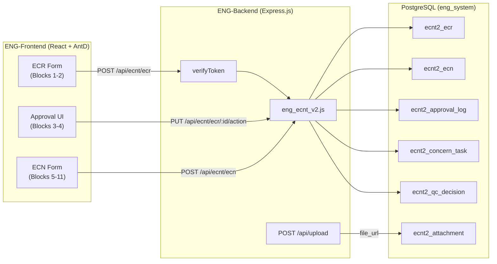

# Phase 1: Architecture & Database Design — ECNT V2

## 1. Architecture Overview

### Integration Strategy: V2 Module within Existing ES

The ECNT V2 will be integrated as a **parallel module** within the existing Engineering System, following the established patterns:

```
EngineerSystem/
├── apps/
│   ├── ENG-Backend/
│   │   ├── api/engineer/process/
│   │   │   ├── eng_process_model.js        ← [EXISTING] Legacy ECR controller (kept for backward compat)
│   │   │   ├── eng_ecnt_v2.js              ← [NEW] V2 ECR/ECN workflow controller
│   │   │   └── ecnt_v2_schema.sql          ← [NEW] V2 migration script
│   │   ├── instance/eng_db.js              ← [REUSE] Same engPool connection
│   │   └── server.js                       ← [MODIFY] Add V2 routes under /api/ecnt/*
│   ├── ENG-Frontend/
│   │   └── src/components/engineer/process_eng/
│   │       ├── ecnt/                       ← [EXISTING] Legacy V1 (kept for reference)
│   │       └── ecnt_v2/                    ← [NEW] V2 11-block components
```

### Key Architectural Decisions

| Decision | Choice | Rationale |
|----------|--------|-----------|
| **Route Prefix** | `/api/ecnt/*` | Avoids collision with existing `/api/ecr/*` routes |
| **DB Pool** | Reuse `engPool` | Same PostgreSQL instance (`eng_system` on Docker 6543) |
| **Auth** | Reuse `verifyToken` middleware | Existing JWT system, no changes needed |
| **File Uploads** | Reuse `POST /api/upload` | Existing `express-fileupload` service at `files/uploads/` |
| **Primary Keys** | `SERIAL` (integer) | Aligns with KI recommendation; existing V1 uses UUID but integer is simpler for URL/routing |
| **Document Separation** | Separate `ecr` + `ecn` tables | New workflow clearly separates ECR (Blocks 1-4) from ECN (Blocks 5-11) |
| **Step Data** | JSONB `details` column | Proven pattern from V1 `ecnt_approval_log` for flexible per-step payloads |

### Data Flow



---

## 2. PostgreSQL V2 Schema

> [!IMPORTANT]
> All new tables use the `ecnt2_` prefix to avoid conflict with existing V1 `ecnt_*` tables. The V1 tables (`ecnt_document`, `ecnt_approval_log`, `ecnt_tasks`, `ecnt_notifications`) are **not modified or dropped** — they remain operational until V2 is fully validated and V1 is decommissioned.

### 2.1 Core Document Tables

#### `ecnt2_ecr` — Engineering Change Request (Blocks 1-4)

```sql
CREATE TABLE IF NOT EXISTS ecnt2_ecr (
    id              SERIAL PRIMARY KEY,
    ecr_no          VARCHAR(20) UNIQUE,                    -- Auto: ECRYYMMxx (assigned at Block 4 Approve)
    
    -- Block 1: Request Header
    ref_coc_no      VARCHAR(100),                          -- Reference from Control of Change System
    request_by      VARCHAR(100) NOT NULL,                 -- Requester u_code
    request_by_name VARCHAR(200),                          -- Requester full name
    request_date    TIMESTAMP DEFAULT CURRENT_TIMESTAMP,
    department      VARCHAR(100),                          -- Requester department (auto from profile)
    
    -- Block 1: Status & Objective
    status_type     VARCHAR(20) DEFAULT 'PERMANENT',       -- PERMANENT | TEMPORARY
    objective       VARCHAR(50),                            -- REDUCE_CYCLE | COST_REDUCTION | INCREASE_USAGE_TOOLING | IMPROVE_YIELD | OTHER
    objective_other TEXT,                                   -- Free text when objective = OTHER
    
    -- Block 1: Change Type Flags (multi-select)
    is_drawing      BOOLEAN DEFAULT FALSE,                 -- Product/Process Drawing
    is_tooling      BOOLEAN DEFAULT FALSE,                 -- Tooling
    is_program      BOOLEAN DEFAULT FALSE,                 -- Program
    is_usage        BOOLEAN DEFAULT FALSE,                 -- Usage
    
    -- Block 1: Title & Reason (common to all change types)
    title_of_change TEXT,
    reason_of_change TEXT,
    
    -- Block 2: Drawing sub-form (when is_drawing = true)
    dwg_part_no         VARCHAR(100),
    dwg_cn              VARCHAR(100),
    dwg_revision        VARCHAR(50),
    dwg_reason_of_change TEXT,
    dwg_before_change   TEXT,                              -- Rich text description
    dwg_after_change    TEXT,                              -- Rich text description
    
    -- Block 2: Tooling sub-form (when is_tooling = true)
    tool_current_no     VARCHAR(100),
    tool_current_usage  VARCHAR(50),                        -- Usage (K/pc)
    tool_new_no         VARCHAR(100),
    tool_new_usage      VARCHAR(50),                        -- Usage (K/pc)
    
    -- Block 2: Program sub-form (when is_program = true)
    prog_before_change  TEXT,                              -- Cutting Program Before Change
    prog_condition_before TEXT,                            -- Cutting Condition Before Change
    prog_after_change   TEXT,                              -- Cutting Program After Change
    prog_condition_after TEXT,                             -- Cutting Condition After Change
    
    -- Block 2: Usage sub-form (when is_usage = true)
    usage_setup_no      VARCHAR(100),                      -- Setup Data Sheet No.
    usage_part_no       VARCHAR(100),
    usage_cn            VARCHAR(100),
    usage_process       VARCHAR(200),
    usage_program_no    VARCHAR(100),
    usage_mc_no         VARCHAR(100),
    usage_cycle_time_before TEXT,
    usage_cycle_time_after  TEXT,
    usage_before_change TEXT,
    usage_after_change  TEXT,
    
    -- Workflow State
    current_block   SMALLINT DEFAULT 1,                    -- Current active block (1-4)
    process_status  VARCHAR(50) DEFAULT 'Draft',           -- Draft | Pending Dept Mgr | Pending Eng Mgr | ECR Only Closed | Issued ECN | Denied | Require More Detail
    assigned_to     VARCHAR(100),                          -- ENG engineer u_code (set at Block 4)
    
    -- Timestamps
    created_at      TIMESTAMP DEFAULT CURRENT_TIMESTAMP,
    updated_at      TIMESTAMP DEFAULT CURRENT_TIMESTAMP
);

CREATE INDEX IF NOT EXISTS idx_ecnt2_ecr_status ON ecnt2_ecr(process_status);
CREATE INDEX IF NOT EXISTS idx_ecnt2_ecr_requester ON ecnt2_ecr(request_by);
CREATE INDEX IF NOT EXISTS idx_ecnt2_ecr_assigned ON ecnt2_ecr(assigned_to);
```

#### `ecnt2_ecn` — Engineering Change Notice (Blocks 5-11)

```sql
CREATE TABLE IF NOT EXISTS ecnt2_ecn (
    id              SERIAL PRIMARY KEY,
    ecn_no          VARCHAR(50) UNIQUE,                    -- Manual input by Eng. Assigned (from Innovator)
    ecr_id          INTEGER NOT NULL REFERENCES ecnt2_ecr(id) ON DELETE CASCADE,
    
    -- Block 5: ECN Header (auto-populated from ECR)
    request_by      VARCHAR(100),                          -- Carried from ECR
    request_date    TIMESTAMP,                             -- Carried from ECR
    department      VARCHAR(100),                          -- Carried from ECR
    engineer_assigned VARCHAR(100),                        -- u_code of Eng. Assigned
    
    -- Block 5: ECN Detail
    title_of_change TEXT,
    reason_of_change TEXT,
    scope_of_implementation TEXT,
    before_change   TEXT,                                   -- Rich text
    after_change    TEXT,                                   -- Rich text
    
    -- Block 5: DWG Control
    dwg_suspended   BOOLEAN DEFAULT FALSE,                 -- Block 5: Confirm DWG Suspend
    dwg_enabled     BOOLEAN DEFAULT FALSE,                 -- Block 10: Confirm DWG Enable
    
    -- Block 5: Related Models
    related_models  JSONB,                                 -- Array of related model references from Excel
    
    -- Block 5: Notice to Customer file reference
    notice_to_customer_file TEXT,
    
    -- Workflow State  
    current_block   SMALLINT DEFAULT 5,                    -- Current active block (5-11)
    process_status  VARCHAR(50) DEFAULT 'Pending Eng Mgr ECN', 
    -- Pending Eng Mgr ECN | Pending QC MSA | Pending QC FAI | Pending Eng Summary |
    -- Pending Concern Approval | Pending Official Close | ECN Effective | Require More Detail
    
    -- Block 11: Official Close
    closed_by       VARCHAR(100),
    closed_by_name  VARCHAR(200),
    closed_date     TIMESTAMP,
    
    -- Timestamps
    created_at      TIMESTAMP DEFAULT CURRENT_TIMESTAMP,
    updated_at      TIMESTAMP DEFAULT CURRENT_TIMESTAMP
);

CREATE INDEX IF NOT EXISTS idx_ecnt2_ecn_ecr ON ecnt2_ecn(ecr_id);
CREATE INDEX IF NOT EXISTS idx_ecnt2_ecn_status ON ecnt2_ecn(process_status);
CREATE INDEX IF NOT EXISTS idx_ecnt2_ecn_engineer ON ecnt2_ecn(engineer_assigned);
```

### 2.2 Impact Assessment (Block 5)

```sql
CREATE TABLE IF NOT EXISTS ecnt2_impact_assessment (
    id              SERIAL PRIMARY KEY,
    ecn_id          INTEGER NOT NULL REFERENCES ecnt2_ecn(id) ON DELETE CASCADE,
    
    -- Customer Impact
    has_customer_impact     BOOLEAN DEFAULT FALSE,
    customer_name           VARCHAR(200),
    m4_request_doc_no       VARCHAR(100),
    customer_notification_date TIMESTAMP,
    customer_change_notice_date TIMESTAMP,
    customer_approved_date  TIMESTAMP,
    
    -- KZW/FJSW Customer Operations
    has_kzw_fjsw_impact     BOOLEAN DEFAULT FALSE,
    operation_type          VARCHAR(50),                    -- 'operation_by_customer' | 'operation_by_thai'
    kzw_notification_date   TIMESTAMP,
    kzw_dcn_ecn_doc_no      VARCHAR(200),
    kzw_doc_received_date   TIMESTAMP,
    
    -- Sale Drawing
    has_sale_drawing_impact  BOOLEAN DEFAULT FALSE,
    sale_drawing_revision_no VARCHAR(200),
    sale_drawing_finish_date TIMESTAMP,
    
    -- Affected Areas (checkbox flags + sub-detail as JSONB)
    has_traceability        BOOLEAN DEFAULT FALSE,
    traceability_details    JSONB,                          -- {lot_no, finish_date}
    
    has_wip_stock           BOOLEAN DEFAULT FALSE,
    wip_stock_details       JSONB,                          -- {models[], disposition_file, finish_date}
    
    has_outsourcing         BOOLEAN DEFAULT FALSE,
    outsourcing_details     JSONB,                          -- {notification_date, by_method, lots[], finish_date}
    
    has_unit_price          BOOLEAN DEFAULT FALSE,
    unit_price_details      JSONB,                          -- {stakeholder_info, cost_factors, finish_date}
    
    has_manufacturing       BOOLEAN DEFAULT FALSE,
    manufacturing_details   JSONB,                          -- {production_methods_doc, tooling_doc, program_doc, additional_items, finish_date}
    
    has_product_quality     BOOLEAN DEFAULT FALSE,
    product_quality_details JSONB,                          -- {inspection_methods_doc, additional_items, finish_date}
    
    has_safety              BOOLEAN DEFAULT FALSE,
    safety_details          JSONB,                          -- {risk_assessment_doc, finish_date}
    
    has_otd                 BOOLEAN DEFAULT FALSE,
    otd_details             JSONB,                          -- {increase_time, estimated_completion_date}
    
    -- Sign-off
    confirmed_by            VARCHAR(100),
    confirmed_date          TIMESTAMP,
    
    created_at              TIMESTAMP DEFAULT CURRENT_TIMESTAMP
);

CREATE INDEX IF NOT EXISTS idx_ecnt2_impact_ecn ON ecnt2_impact_assessment(ecn_id);
```

### 2.3 QC Decisions (Blocks 7-8)

```sql
CREATE TABLE IF NOT EXISTS ecnt2_qc_decision (
    id              SERIAL PRIMARY KEY,
    ecn_id          INTEGER NOT NULL REFERENCES ecnt2_ecn(id) ON DELETE CASCADE,
    decision_type   VARCHAR(10) NOT NULL,                  -- 'MSA' (Block 7) | 'FAI' (Block 8)
    
    decision        VARCHAR(20) NOT NULL,                  -- 'REQUIRE' | 'NOT_REQUIRE'
    fai_type        VARCHAR(20),                           -- 'DELTA' | 'FULL' (only for FAI)
    reason          TEXT,
    
    confirmed_by    VARCHAR(100),                          -- QC u_code
    confirmed_by_name VARCHAR(200),
    confirmed_date  TIMESTAMP,
    
    created_at      TIMESTAMP DEFAULT CURRENT_TIMESTAMP
);

CREATE INDEX IF NOT EXISTS idx_ecnt2_qc_ecn ON ecnt2_qc_decision(ecn_id);
```

### 2.4 FAI Summary (Block 9)

```sql
CREATE TABLE IF NOT EXISTS ecnt2_fai_summary (
    id              SERIAL PRIMARY KEY,
    ecn_id          INTEGER NOT NULL REFERENCES ecnt2_ecn(id) ON DELETE CASCADE,
    
    fai_approved_confirmed BOOLEAN DEFAULT FALSE,          -- Checkbox: FAI Approved confirmation
    fai_lot_no      VARCHAR(200),
    summary_result  TEXT,
    stakeholder_comment TEXT,
    
    confirmed_by    VARCHAR(100),                          -- Eng. Assigned u_code
    confirmed_by_name VARCHAR(200),
    confirmed_date  TIMESTAMP,
    
    created_at      TIMESTAMP DEFAULT CURRENT_TIMESTAMP
);
```

### 2.5 Concern Approval Tasks (Block 10)

```sql
CREATE TABLE IF NOT EXISTS ecnt2_concern_task (
    id              SERIAL PRIMARY KEY,
    ecn_id          INTEGER NOT NULL REFERENCES ecnt2_ecn(id) ON DELETE CASCADE,
    
    dept_code       VARCHAR(10) NOT NULL,                  -- PC | QA | QC | PD1 | PD2 | MC | MM
    dept_label      VARCHAR(100),                          -- Display label
    is_needed       BOOLEAN DEFAULT FALSE,                 -- Engineer selects NEED/NO NEED
    
    -- Acknowledgment (filled by dept person)
    approved_by     VARCHAR(100),                          -- u_code
    approved_by_name VARCHAR(200),
    approved_date   TIMESTAMP,
    status          VARCHAR(20) DEFAULT 'PENDING',         -- PENDING | ACKNOWLEDGED | NOT_NEEDED
    
    created_at      TIMESTAMP DEFAULT CURRENT_TIMESTAMP
);

CREATE INDEX IF NOT EXISTS idx_ecnt2_concern_ecn ON ecnt2_concern_task(ecn_id);
```

### 2.6 Approval Log (All Blocks)

```sql
CREATE TABLE IF NOT EXISTS ecnt2_approval_log (
    id              SERIAL PRIMARY KEY,
    
    -- Polymorphic reference (can point to ECR or ECN)
    document_type   VARCHAR(3) NOT NULL,                   -- 'ECR' | 'ECN'
    document_id     INTEGER NOT NULL,                      -- FK to ecnt2_ecr.id or ecnt2_ecn.id
    
    block_number    SMALLINT NOT NULL,                     -- 1-11
    step_label      VARCHAR(100),                          -- Human-readable step name
    
    action          VARCHAR(30) NOT NULL,                  -- APPROVE | DENY | REQUEST_MORE_DETAIL | RESUBMIT | SUBMIT | ACKNOWLEDGE
    action_by       VARCHAR(100) NOT NULL,                 -- u_code
    action_by_name  VARCHAR(200),
    action_role     VARCHAR(100),                          -- Role description
    
    comment         TEXT,
    deny_reason     TEXT,
    request_to_requester TEXT,                             -- Message when requesting more detail
    
    details         JSONB,                                 -- Flexible per-step payload
    
    created_at      TIMESTAMP DEFAULT CURRENT_TIMESTAMP
);

CREATE INDEX IF NOT EXISTS idx_ecnt2_log_ecr ON ecnt2_approval_log(document_type, document_id);
CREATE INDEX IF NOT EXISTS idx_ecnt2_log_block ON ecnt2_approval_log(block_number);
```

### 2.7 File Attachments

```sql
CREATE TABLE IF NOT EXISTS ecnt2_attachment (
    id              SERIAL PRIMARY KEY,
    
    document_type   VARCHAR(3) NOT NULL,                   -- 'ECR' | 'ECN'
    document_id     INTEGER NOT NULL,
    block_number    SMALLINT,
    field_name      VARCHAR(100),                          -- e.g., 'dwg_before_change', 'fai_summary_result'
    
    file_name       VARCHAR(500),
    file_url        VARCHAR(1000) NOT NULL,                -- URL from /api/upload
    file_type       VARCHAR(50),                           -- MIME type
    file_size       INTEGER,
    
    uploaded_by     VARCHAR(100),
    created_at      TIMESTAMP DEFAULT CURRENT_TIMESTAMP
);

CREATE INDEX IF NOT EXISTS idx_ecnt2_attach_doc ON ecnt2_attachment(document_type, document_id);
```

### 2.8 Notification Log

```sql
CREATE TABLE IF NOT EXISTS ecnt2_notification (
    id              SERIAL PRIMARY KEY,
    
    document_type   VARCHAR(3) NOT NULL,
    document_id     INTEGER NOT NULL,
    block_number    SMALLINT,
    
    recipient       VARCHAR(100),                          -- u_code of recipient
    recipient_email VARCHAR(200),
    email_type      VARCHAR(50),                           -- NEW_ECR | APPROVAL_NEEDED | RMD | DENIED | ECN_EFFECTIVE
    subject         VARCHAR(500),
    body            TEXT,
    
    is_sent         BOOLEAN DEFAULT FALSE,
    sent_at         TIMESTAMP,
    error_message   TEXT,
    
    created_at      TIMESTAMP DEFAULT CURRENT_TIMESTAMP
);
```

### 2.9 Master Person-In-Charge (Seed Data)

```sql
CREATE TABLE IF NOT EXISTS ecnt2_master_pic (
    id              SERIAL PRIMARY KEY,
    role_code       VARCHAR(30) NOT NULL UNIQUE,            -- ENG_MGR | ENG_ASSIGNED | QC_FAI | PC | QA | QC | PD1 | PD2 | MC | MM | THAI_MGR | JP_MGR
    role_label      VARCHAR(200) NOT NULL,
    person_name     VARCHAR(200) NOT NULL,
    u_code          VARCHAR(20),                           -- Link to m_user_profile if exists
    department      VARCHAR(100),
    is_active       BOOLEAN DEFAULT TRUE,
    updated_at      TIMESTAMP DEFAULT CURRENT_TIMESTAMP
);

-- Seed Data (from Detail for system.xlsx)
INSERT INTO ecnt2_master_pic (role_code, role_label, person_name, department) VALUES
    ('ENG_MGR',      'Eng. Dept Manager',              'TEERAPOL KANTAPOOM',       'ENG'),
    ('ENG_ASSIGNED', 'Eng. Assigned',                  'NATHAPORN YAMMANUS',       'ENG'),
    ('QC_FAI',       'QC Decision for FAI',            'PATCHARAYADA WAIYABOON',   'QC'),
    ('PC',           'PC',                             'TASANEE CHUDUANG',         'PC'),
    ('QA',           'QA',                             'CHUANPIT KHATTIYA',        'QA'),
    ('QC',           'QC',                             'SUPARAT KATSANUK',         'QC'),
    ('PD1',          'Production #1',                  'CHANASORN MEEPRO',         'PD'),
    ('PD2',          'Production #2',                  'WATCHARIYA ROEKARAM',      'PD'),
    ('MC',           'MC',                             'PUSSADEE ROIKEAW',         'MC'),
    ('MM',           'MM',                             'Sarunyu Chokchaikasemsuk', 'MM'),
    ('THAI_MGR',     'Thai Manager/Div. Head',         'Sakda Tantidechamongkol',  'MGT'),
    ('JP_MGR',       'Japanese Manager',               'Ryoichi Furuta',           'MGT')
ON CONFLICT (role_code) DO UPDATE SET
    person_name = EXCLUDED.person_name,
    updated_at = NOW();
```

---

## 3. Block-to-Database Mapping

This maps every workflow block to the tables and columns it reads/writes:

| Block | Table(s) Written | Key Columns / JSONB Payloads |
|-------|-----------------|------------------------------|
| **1** | `ecnt2_ecr` | `ref_coc_no`, `request_by`, `department`, `status_type`, `objective`, change flags |
| **2** | `ecnt2_ecr`, `ecnt2_attachment` | `dwg_*`, `tool_*`, `prog_*`, `usage_*` (conditional by change flags) |
| **3** | `ecnt2_approval_log` | block=3, action=APPROVE/DENY/RMD, `comment`, `deny_reason` |
| **4** | `ecnt2_ecr`, `ecnt2_approval_log` | `ecr_no` (auto-assign), `assigned_to`, `process_status` → Issue ECN / ECR Only |
| **5** | `ecnt2_ecn`, `ecnt2_impact_assessment`, `ecnt2_attachment` | ECN detail, impact areas, DWG suspend |
| **6** | `ecnt2_approval_log` | block=6, action=APPROVE/RMD |
| **7** | `ecnt2_qc_decision` | `decision_type='MSA'`, `decision`, `reason` |
| **8** | `ecnt2_qc_decision` | `decision_type='FAI'`, `decision`, `fai_type`, `reason` |
| **9** | `ecnt2_fai_summary` | `fai_lot_no`, `summary_result`, `stakeholder_comment` |
| **10** | `ecnt2_concern_task` | Per-department NEED/NO NEED + acknowledgment sign-off, DWG Enable |
| **11** | `ecnt2_ecn`, `ecnt2_approval_log`, `ecnt2_notification` | `closed_by`, `closed_date`, PDF generation trigger |

---

## 4. V1 → V2 Migration Strategy

> [!NOTE]
> The V1 and V2 schemas will coexist during the transition period. No V1 tables are modified.

| Aspect | V1 (Current) | V2 (New) |
|--------|-------------|----------|
| Table prefix | `ecnt_` | `ecnt2_` |
| Primary Key | UUID | SERIAL (integer) |
| ECR/ECN | Single `ecnt_document` table | Separate `ecnt2_ecr` + `ecnt2_ecn` |
| Step tracking | String `step_number` (e.g. '3.1') | Integer `block_number` (1-11) |
| Impact Assessment | Stored in `details` JSONB of approval log | Dedicated `ecnt2_impact_assessment` table |
| QC Decisions | Stored in `details` JSONB | Dedicated `ecnt2_qc_decision` table |
| Multi-dept approval | `ecnt_tasks` (generic) | `ecnt2_concern_task` (structured with dept codes) |
| Master PIC list | Hardcoded in frontend | `ecnt2_master_pic` table (configurable) |
| Routes | `/api/ecr/*` | `/api/ecnt/*` |

**Data migration** of active V1 documents (if needed) can be scripted after V2 is stable. For now, both systems run independently.

---

## 5. API Route Plan (Preview for Phase 2)

| Method | Route | Block | Description |
|--------|-------|-------|-------------|
| `POST` | `/api/ecnt/ecr` | 1-2 | Create ECR with detail |
| `GET` | `/api/ecnt/ecr` | — | List ECRs (filtered) |
| `GET` | `/api/ecnt/ecr/:id` | — | Get ECR with logs & attachments |
| `PUT` | `/api/ecnt/ecr/:id/action` | 3-4 | Approve/Deny/RMD |
| `PUT` | `/api/ecnt/ecr/:id/resubmit` | 1 | Resubmit after RMD |
| `POST` | `/api/ecnt/ecn` | 5 | Create ECN from approved ECR |
| `GET` | `/api/ecnt/ecn/:id` | — | Get ECN with full detail |
| `PUT` | `/api/ecnt/ecn/:id/action` | 6 | Eng Mgr approve/RMD ECN |
| `PUT` | `/api/ecnt/ecn/:id/qc-decision` | 7-8 | QC submit MSA/FAI |
| `PUT` | `/api/ecnt/ecn/:id/fai-summary` | 9 | Eng submit FAI summary |
| `GET` | `/api/ecnt/ecn/:id/concerns` | 10 | Get concern task list |
| `PUT` | `/api/ecnt/ecn/:id/concern/:taskId` | 10 | Dept acknowledge |
| `PUT` | `/api/ecnt/ecn/:id/close` | 11 | Official close |
| `GET` | `/api/ecnt/ecn/:id/pdf` | 11 | Generate PDF |
| `GET` | `/api/ecnt/master-pic` | — | Get master PIC list |
| `PUT` | `/api/ecnt/master-pic/:id` | — | Update PIC assignment |
| `GET` | `/api/ecnt/dashboard` | — | Dashboard statistics |
| `GET` | `/api/ecnt/my-tasks` | — | Current user's pending tasks |
