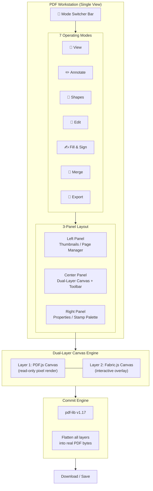

# PDF Workstation — All-in-One Apryse Clone

A **unified PDF Workstation** that consolidates **all** PDF Hub tools (View, Annotate, Shapes, Edit, Fill & Sign, Merge, Export to Image) into a single, powerful editor interface — replacing the current multi-tool sidebar navigation.

---

## Architecture: The Unified Workstation



### Design Philosophy: One Tool to Rule Them All

Instead of 4 separate sidebar pages (Sign & Stamp, Merge, To-Image, DWG Check), the Workstation provides a **single canvas** with a **mode switcher** — similar to how Photoshop or Figma work. Every mode shares the same document context:

| Current (Separate Tools) | New (Unified Workstation) |
|:---|:---|
| Open Sign & Stamp → upload PDF → place stamps | Open Workstation → upload PDF → switch to Sign mode |
| Open PDF Merger → upload multiple PDFs → merge | Same Workstation → switch to Merge mode → add files |
| Open PDF to Image → upload PDF → convert | Same Workstation → switch to Export mode → select pages |
| Open DWG Check → upload PDF → view | Same Workstation → View mode is default |

> [!TIP]
> The existing standalone tools ([PdfMergerWrapper.jsx](file:///d:/97_Projects/00_System/EngineerSystem/apps/ENG-Frontend/src/components/engineer/system_eng/pdf_hub/PdfMergerWrapper.jsx), [PdfToImageWrapper.jsx](file:///d:/97_Projects/00_System/EngineerSystem/apps/ENG-Frontend/src/components/engineer/system_eng/pdf_hub/PdfToImageWrapper.jsx), [SignStampTool.jsx](file:///d:/97_Projects/00_System/EngineerSystem/apps/ENG-Frontend/src/components/engineer/system_eng/pdf_hub/SignStamp/SignStampTool.jsx)) will remain available as routes for backward compatibility but the Workstation becomes the primary entry point.

---

## User Review Required

> [!IMPORTANT]
> **Fabric.js v6** is the recommended interactive canvas library. It provides:
> - Native text editing on canvas (IText, Textbox) — critical for Edit mode
> - SVG path serialization — needed for freehand + arrow annotations
> - Built-in object manipulation (resize, rotate, group, clone)
> - ~180KB gzipped — acceptable since Three.js (~600KB) is already in the bundle

> [!WARNING]
> **"Edit existing PDF text"** uses the **Mask & Replace** pattern (industry standard for web-based editors):
> 1. White rectangle masks the original text
> 2. New `Fabric.IText` object overlays with matching font/size
> 3. pdf-lib commits both the mask rect and new text
>
> True glyph-level editing is impossible without a C++/WASM engine like PDFium. This approach matches Smallpdf, ILovePDF, and DocHub.

> [!IMPORTANT]
> **PDF-to-Image conversion will be moved client-side** using the same PDF.js canvas rendering already used for the viewer. This eliminates the server roundtrip currently used by [pdfConverter.js](file:///d:/97_Projects/00_System/EngineerSystem/apps/ENG-Backend/api/engineer/system/pdfConverter.js). The backend API remains available as a fallback for very large documents.

---

## Open Questions

> [!IMPORTANT]
> 1. **Should the Workstation replace the PDF Hub sidebar entirely?**
>    - **Option A** (Recommended): The PDF Hub route `/eng/pdf-hub` opens directly into the Workstation. The sidebar is replaced by the workstation's own mode switcher.
>    - **Option B**: Keep the sidebar but add "Workstation" as the first/default item alongside the existing tools.
>
> 2. **Annotation persistence**: Start client-side only (like Sign & Stamp), or build database persistence from Phase 1?
>    - Recommended: **Client-side first** → add persistence in Phase 2.
>
> 3. **DWG Check integration**: Should DWG Check remain as a separate tool (it has unique validation logic), or be absorbed into the Workstation's View mode?

---

## Dual-Layer Canvas Architecture

### How the Two Layers Work Together

```
┌────────────────────────────────────────┐
│          <div> Container               │  position: relative
│  ┌──────────────────────────────────┐  │
│  │    <canvas> PDF.js (Layer 1)     │  │  pointer-events: none
│  │    Pixel render of PDF page      │  │  z-index: 1
│  │    Rendered at 2x for retina     │  │
│  └──────────────────────────────────┘  │
│  ┌──────────────────────────────────┐  │
│  │    <canvas> Fabric.js (Layer 2)  │  │  position: absolute; top:0; left:0
│  │    Transparent interactive layer │  │  z-index: 2
│  │    All user events handled here  │  │
│  └──────────────────────────────────┘  │
└────────────────────────────────────────┘
```

### Coordinate Math (Reusing existing proven logic from [useSignStamp.js](file:///d:/97_Projects/00_System/EngineerSystem/apps/ENG-Frontend/src/components/engineer/system_eng/pdf_hub/SignStamp/useSignStamp.js))

```javascript
// 1mm = 72/25.4 ≈ 2.83465 PDF points (already defined)
const MM_TO_POINTS = 72 / 25.4;

// Screen (Fabric.js) → PDF (pdf-lib) coordinate conversion
// PDF origin = bottom-left, Y goes up. Screen origin = top-left, Y goes down.
function fabricToPdf(fabricObj, canvasW, canvasH, pageW, pageH) {
    const scaleX = pageW / canvasW;
    const scaleY = pageH / canvasH;
    return {
        x: fabricObj.left * scaleX,
        y: pageH - ((fabricObj.top + fabricObj.height * fabricObj.scaleY) * scaleY),
        width: fabricObj.width * fabricObj.scaleX * scaleX,
        height: fabricObj.height * fabricObj.scaleY * scaleY,
    };
}
```

### Zoom Synchronization
When zoom changes:
1. PDF.js re-renders at `newScale * 1.5` (super-resolution) → display at `newScale`
2. Fabric.js canvas resizes to match display dimensions
3. All Fabric.js objects scale proportionally via `canvas.setZoom()`
4. Per-page annotation state is stored at `zoom=1.0` (normalized) and scaled on load

---

## Proposed Changes — Module by Module

### Module 1: Workstation Core

New directory: `pdf_hub/PdfEditor/`

#### [NEW] [PdfEditorTool.jsx](file:///d:/97_Projects/00_System/EngineerSystem/apps/ENG-Frontend/src/components/engineer/system_eng/pdf_hub/PdfEditor/PdfEditorTool.jsx)
Main orchestrator. Manages mode switching, panel visibility, and global toolbar.

**Layout Blueprint:**
```
┌──────────────────────────────────────────────────────────────────┐
│  Mode Switcher: [View] [Annotate] [Shapes] [Edit] [Sign] [Merge] [Export]  │
├────────┬──────────────────────────────────────────┬──────────────┤
│        │  Toolbar (context-sensitive per mode)    │              │
│        ├──────────────────────────────────────────┤              │
│ Thumb  │                                          │  Properties  │
│ nails  │          Dual-Layer Canvas                │  / Stamps   │
│ Panel  │          (PDF.js + Fabric.js)             │  / Export   │
│        │                                          │  Options    │
│ 180px  │            flex: 1                       │    280px     │
│        │                                          │              │
├────────┼──────────────────────────────────────────┼──────────────┤
│        │  Status: Page 3/12 | Zoom 100% | 5 annotations        │
└────────┴──────────────────────────────────────────┴──────────────┘
```

**Mode Switcher** — Ant Design `Segmented` component with icons:
```jsx
<Segmented
    options={[
        { value: 'view',     icon: <EyeOutlined />,         label: 'View' },
        { value: 'annotate', icon: <HighlightOutlined />,   label: 'Annotate' },
        { value: 'shapes',   icon: <BorderOutlined />,      label: 'Shapes' },
        { value: 'edit',     icon: <EditOutlined />,        label: 'Edit' },
        { value: 'sign',     icon: <FormOutlined />,        label: 'Fill & Sign' },
        { value: 'merge',    icon: <MergeCellsOutlined />,  label: 'Merge' },
        { value: 'export',   icon: <FileImageOutlined />,   label: 'Export' },
    ]}
    onChange={setActiveMode}
/>
```

#### [NEW] [PdfEditorTool.css](file:///d:/97_Projects/00_System/EngineerSystem/apps/ENG-Frontend/src/components/engineer/system_eng/pdf_hub/PdfEditor/PdfEditorTool.css)
Premium styling following project conventions:
- Glassmorphism mode switcher bar
- Smooth mode transitions with CSS animations
- Responsive breakpoints (collapse panels on mobile)
- Theme-aware colors via CSS variables
- Custom scrollbars via `.kb-vscroll` class

#### [NEW] [usePdfEditor.js](file:///d:/97_Projects/00_System/EngineerSystem/apps/ENG-Frontend/src/components/engineer/system_eng/pdf_hub/PdfEditor/usePdfEditor.js)
Master hook consolidating logic from existing hooks:

```javascript
export default function usePdfEditor() {
    // === PDF Document State ===
    const [pdfFile, setPdfFile] = useState(null);
    const [pdfDoc, setPdfDoc] = useState(null);         // pdfjs-dist (rendering)
    const [pdfLibDoc, setPdfLibDoc] = useState(null);    // pdf-lib (manipulation)
    const [pdfBytes, setPdfBytes] = useState(null);      // Raw bytes
    const [totalPages, setTotalPages] = useState(0);
    const [currentPage, setCurrentPage] = useState(1);
    const [zoom, setZoom] = useState(1.0);

    // === Mode & Tool State ===
    const [activeMode, setActiveMode] = useState('view');
    const [activeTool, setActiveTool] = useState('select');
    
    // === Per-Page Annotations (Fabric.js JSON) ===
    const [pageAnnotations, setPageAnnotations] = useState({});
    
    // === History (Undo/Redo) ===
    const [history, setHistory] = useState([]);
    const [historyIndex, setHistoryIndex] = useState(-1);
    
    // === Merge Mode State ===
    const [mergeFiles, setMergeFiles] = useState([]);
    
    // === Export Mode State ===
    const [exportFormat, setExportFormat] = useState('jpg');
    const [exportPages, setExportPages] = useState('');
    const [exportedImages, setExportedImages] = useState([]);
    
    // === Fill & Sign State ===
    const [formFields, setFormFields] = useState([]);
    const [formValues, setFormValues] = useState({});
    const [stampData, setStampData] = useState(null);
    
    // === Properties Panel ===
    const [selectedObject, setSelectedObject] = useState(null);
    const [strokeColor, setStrokeColor] = useState('#ff0000');
    const [fillColor, setFillColor] = useState('transparent');
    const [strokeWidth, setStrokeWidth] = useState(2);
    const [fontSize, setFontSize] = useState(14);
    const [opacity, setOpacity] = useState(1.0);
    
    // ... methods for each mode
}
```

#### [NEW] [usePdfEditorStore.js](file:///d:/97_Projects/00_System/EngineerSystem/apps/ENG-Frontend/src/stores/usePdfEditorStore.js)
Zustand store for state shared across deeply nested components (toolbar ↔ canvas ↔ properties panel):

```javascript
import { create } from 'zustand';

export const usePdfEditorStore = create((set) => ({
    activeMode: 'view',
    activeTool: 'select',
    selectedObjectId: null,
    
    // Drawing properties
    strokeColor: '#e74c3c',
    fillColor: 'transparent',
    strokeWidth: 2,
    fontSize: 14,
    fontFamily: 'Helvetica',
    opacity: 1.0,
    
    // Actions
    setActiveMode: (mode) => set({ activeMode: mode }),
    setActiveTool: (tool) => set({ activeTool: tool }),
    setSelectedObjectId: (id) => set({ selectedObjectId: id }),
    setStrokeColor: (c) => set({ strokeColor: c }),
    setFillColor: (c) => set({ fillColor: c }),
    setStrokeWidth: (w) => set({ strokeWidth: w }),
    setFontSize: (s) => set({ fontSize: s }),
    setOpacity: (o) => set({ opacity: o }),
}));
```

---

### Module 2: Dual-Layer Canvas

#### [NEW] [EditorCanvas.jsx](file:///d:/97_Projects/00_System/EngineerSystem/apps/ENG-Frontend/src/components/engineer/system_eng/pdf_hub/PdfEditor/EditorCanvas.jsx)
The synchronized two-canvas system:

**Lifecycle per page change:**
1. `saveCurrentPageState()` → serialize Fabric.js canvas → store in `pageAnnotations[currentPage]`
2. `renderPdfPage(newPage)` → PDF.js renders to Layer 1
3. `loadPageState(newPage)` → deserialize `pageAnnotations[newPage]` → load into Fabric.js
4. `syncCanvasDimensions()` → ensure both canvases match

**Lifecycle per zoom change:**
1. PDF.js re-renders at new viewport scale
2. Fabric.js `canvas.setDimensions()` matches new size
3. All objects rescale via `canvas.setZoom(newZoom / baseZoom)`

**Tool mode configuration:**
```javascript
const configureCanvasForTool = (canvas, tool) => {
    canvas.isDrawingMode = (tool === 'freehand');
    canvas.selection = (tool === 'select');
    canvas.defaultCursor = TOOL_CURSORS[tool]; // crosshair, move, text, etc.
    
    if (tool === 'freehand') {
        canvas.freeDrawingBrush = new fabric.PencilBrush(canvas);
        canvas.freeDrawingBrush.color = strokeColor;
        canvas.freeDrawingBrush.width = strokeWidth;
    }
};
```

---

### Module 3: Thumbnail Panel (Multi-Purpose)

#### [NEW] [ThumbnailPanel.jsx](file:///d:/97_Projects/00_System/EngineerSystem/apps/ENG-Frontend/src/components/engineer/system_eng/pdf_hub/PdfEditor/ThumbnailPanel.jsx)

The left panel adapts based on the active mode:

| Mode | Panel Behavior |
|------|---------------|
| **View / Annotate / Shapes / Edit / Sign** | Page thumbnails with annotation badges. Click to navigate. |
| **Merge** | File list with drag-to-reorder (reusing dnd-kit from [PdfMergerWrapper](file:///d:/97_Projects/00_System/EngineerSystem/apps/ENG-Frontend/src/components/engineer/system_eng/pdf_hub/PdfMergerWrapper.jsx)). "Add Files" button at bottom. Shows combined page count. |
| **Export** | Page thumbnails with checkboxes for selective export. "Select All / Deselect All" toggle. |

**Thumbnail rendering** — Lazy render at `scale=0.25` using PDF.js:
```javascript
const renderThumbnail = async (pdfDoc, pageNum, canvas) => {
    const page = await pdfDoc.getPage(pageNum);
    const viewport = page.getViewport({ scale: 0.25 });
    canvas.width = viewport.width;
    canvas.height = viewport.height;
    await page.render({
        canvasContext: canvas.getContext('2d'),
        viewport,
    }).promise;
};
```

Uses `IntersectionObserver` to only render visible thumbnails (performance for 100+ page documents).

---

### Module 4: Annotations (Annotate Mode)

#### [NEW] [tools/AnnotationTools.js](file:///d:/97_Projects/00_System/EngineerSystem/apps/ENG-Frontend/src/components/engineer/system_eng/pdf_hub/PdfEditor/tools/AnnotationTools.js)

**Toolbar for Annotate mode:**
```
[Highlight ■] [Underline ─] [Strikethrough ─] [Sticky Note 📝] │ [Color 🎨] [Opacity ░]
```

| Tool | Fabric.js Implementation | Interaction |
|------|--------------------------|-------------|
| **Highlight** | `new fabric.Rect({ fill: color, opacity: 0.3, rx: 2 })` | Click + drag rectangle |
| **Underline** | `new fabric.Line([x1, y, x2, y], { stroke: color, strokeWidth: 2 })` | Click + drag horizontal line |
| **Strikethrough** | Same as underline but positioned at mid-height | Click + drag horizontal line |
| **Sticky Note** | `new fabric.Group([iconRect, iconText])` with metadata | Click to place → popover for text |

Each annotation carries metadata:
```javascript
fabricObj.set('customData', {
    type: 'highlight',    // highlight | underline | strikethrough | sticky
    color: '#ffeb3b',
    note: '',             // For sticky notes
    author: empNo,
    createdAt: Date.now(),
});
```

---

### Module 5: Shapes (Shapes Mode)

#### [NEW] [tools/ShapeTools.js](file:///d:/97_Projects/00_System/EngineerSystem/apps/ENG-Frontend/src/components/engineer/system_eng/pdf_hub/PdfEditor/tools/ShapeTools.js)

**Toolbar for Shapes mode:**
```
[Rectangle □] [Circle ○] [Arrow →] [Line ─] [Freehand ✎] │ [Stroke 🎨] [Fill 🎨] [Width ─] [Opacity ░]
```

| Tool | Implementation | Draw UX |
|------|---------------|---------|
| **Rectangle** | `new fabric.Rect({ stroke, fill, strokeWidth, rx: 2 })` | mousedown → mousemove (resize) → mouseup |
| **Circle** | `new fabric.Ellipse({ stroke, fill, rx, ry })` | mousedown → mousemove (resize) → mouseup |
| **Arrow** | `fabric.Group([fabric.Line, fabric.Triangle])` | Click start point → click end point |
| **Line** | `new fabric.Line([x1,y1,x2,y2])` | Click start → click end |
| **Freehand** | `canvas.isDrawingMode = true` with `PencilBrush` | Free draw, auto-creates `fabric.Path` |

All shapes get Fabric.js built-in controls: 8 resize handles + rotation handle.

---

### Module 6: Edit Text (Edit Mode)

#### [NEW] [tools/TextEditTools.js](file:///d:/97_Projects/00_System/EngineerSystem/apps/ENG-Frontend/src/components/engineer/system_eng/pdf_hub/PdfEditor/tools/TextEditTools.js)

**Toolbar for Edit mode:**
```
[Add Text T] [Mask & Replace ▯] │ [Font ▾] [Size ▾] [Color 🎨] [Bold B] [Italic I]
```

**Add Text** — Click anywhere to place a `fabric.IText` (editable text):
```javascript
const addText = (x, y) => {
    const text = new fabric.IText('Type here...', {
        left: x, top: y,
        fontSize: store.fontSize,
        fontFamily: store.fontFamily,
        fill: store.strokeColor,
        editable: true,
        customData: { type: 'text-overlay' },
    });
    canvas.add(text);
    canvas.setActiveObject(text);
    text.enterEditing(); // Immediately start typing
};
```

**Mask & Replace** — Two-step process:
1. User draws a rectangle → creates a white-filled `fabric.Rect` (mask layer)
2. Automatically creates an `fabric.IText` on top, sized to match
3. Both are grouped — moving the group moves both

**Properties Panel** for Edit mode shows:
- Font family dropdown (Helvetica, Times, Courier, + custom uploaded)
- Font size slider/input
- Color picker
- Bold / Italic / Underline toggles
- Text alignment (left, center, right)

---

### Module 7: Fill & Sign (Sign Mode)

#### [NEW] [tools/FillSignTools.js](file:///d:/97_Projects/00_System/EngineerSystem/apps/ENG-Frontend/src/components/engineer/system_eng/pdf_hub/PdfEditor/tools/FillSignTools.js)

**Toolbar for Sign mode:**
```
[Fill Form 📋] [Add Signature ✍] [Add Stamp 🔏] [Add Date 📅] │ [Flatten Forms ⏏]
```

**AcroForm Detection & Filling:**
```javascript
const detectFormFields = async (pdfLibDoc) => {
    try {
        const form = pdfLibDoc.getForm();
        const fields = form.getFields();
        
        return fields.map(field => {
            const widgets = field.acroField.getWidgets();
            const widget = widgets[0]; // Primary widget
            const rect = widget.getRectangle();
            
            return {
                name: field.getName(),
                type: field.constructor.name, // PDFTextField, PDFCheckBox, etc.
                rect: { x: rect.x, y: rect.y, w: rect.width, h: rect.height },
                pageIndex: /* determine page */,
                value: field instanceof PDFTextField ? field.getText() : null,
                options: field instanceof PDFDropdown ? field.getOptions() : null,
            };
        });
    } catch {
        return []; // PDF has no forms
    }
};
```

Each form field renders as a Fabric.js overlay:
- **Text fields** → `fabric.Textbox` with blue border
- **Checkboxes** → Custom click handler with ✓ / ✗ toggle
- **Dropdowns** → Absolutely-positioned Ant Design `<Select>`
- **Radio buttons** → Group-aware toggle

**Signature Pad** — Modal with 3 tabs:
1. **Draw** tab: HTML5 Canvas with smooth Bézier curve interpolation
2. **Type** tab: Text input → rendered with script font (Dancing Script / Caveat via Google Fonts)
3. **Upload** tab: Image upload → auto-crop whitespace

Output: PNG base64 → placed as `fabric.Image` → committed via `pdf-lib.embedPng()`

**Stamp Integration** — Reuses existing [StampPalette.jsx](file:///d:/97_Projects/00_System/EngineerSystem/apps/ENG-Frontend/src/components/engineer/system_eng/pdf_hub/SignStamp/StampPalette.jsx) and [pdfHubController.js](file:///d:/97_Projects/00_System/EngineerSystem/apps/ENG-Backend/api/engineer/system/pdfHubController.js) API. The Properties Panel in Sign mode shows the stamp palette.

---

### Module 8: Merge (Merge Mode)

#### [NEW] [tools/MergeTools.js](file:///d:/97_Projects/00_System/EngineerSystem/apps/ENG-Frontend/src/components/engineer/system_eng/pdf_hub/PdfEditor/tools/MergeTools.js)

When Merge mode is active:
- **Left Panel** transforms into a file manager (not thumbnails)
- **Center Canvas** shows a preview of the combined result
- **Right Panel** shows merge options

**Merge flow** (absorbs logic from [PdfMergerWrapper.jsx](file:///d:/97_Projects/00_System/EngineerSystem/apps/ENG-Frontend/src/components/engineer/system_eng/pdf_hub/PdfMergerWrapper.jsx)):

```
┌──────────┐  ┌───────────────────────────────────┐  ┌───────────┐
│ File List │  │         Preview Canvas             │  │  Options  │
│           │  │                                    │  │           │
│ 📄 Doc1   │  │  ┌────┐ ┌────┐ ┌────┐ ┌────┐     │  │ □ Flatten │
│ 📄 Doc2   │  │  │ P1 │ │ P2 │ │ P3 │ │ P4 │     │  │ □ Compress│
│ 📄 Doc3   │  │  │ D1 │ │ D1 │ │ D2 │ │ D3 │     │  │           │
│  ↕ drag   │  │  └────┘ └────┘ └────┘ └────┘     │  │ [Merge ▶] │
│ [+] Add   │  │  Combined: 4 pages, 2.3 MB       │  │           │
└──────────┘  └───────────────────────────────────┘  └───────────┘
```

**Reusing existing code:**
- `@dnd-kit/core` + `@dnd-kit/sortable` for drag-to-reorder (already installed, used in PdfMergerWrapper)
- `PDFDocument.create()` + `mergedPdf.copyPages()` from pdf-lib (existing merge logic)
- After merge → automatically loads result into the canvas for further editing/annotation

**Key enhancement over current merger:** After merging, the result loads directly into the workstation so you can immediately annotate, sign, or export — no need to download and re-upload.

---

### Module 9: Export to Image (Export Mode)

#### [NEW] [tools/ExportTools.js](file:///d:/97_Projects/00_System/EngineerSystem/apps/ENG-Frontend/src/components/engineer/system_eng/pdf_hub/PdfEditor/tools/ExportTools.js)

**Client-side conversion** (no server roundtrip needed):

```javascript
const exportPageToImage = async (pdfDoc, pageNum, format = 'jpg', scale = 2.0) => {
    const page = await pdfDoc.getPage(pageNum);
    const viewport = page.getViewport({ scale });
    
    const canvas = document.createElement('canvas');
    canvas.width = viewport.width;
    canvas.height = viewport.height;
    const ctx = canvas.getContext('2d');
    
    // Render PDF page
    await page.render({ canvasContext: ctx, viewport }).promise;
    
    // If there are annotations on this page, render Fabric.js layer on top
    const annotations = pageAnnotations[pageNum];
    if (annotations) {
        // Create temporary Fabric.js canvas, load annotations, render to image
        const tempCanvas = new fabric.StaticCanvas(null, {
            width: viewport.width,
            height: viewport.height,
        });
        await tempCanvas.loadFromJSON(annotations);
        // Composite Fabric.js output onto PDF canvas
        ctx.drawImage(tempCanvas.toCanvasElement(), 0, 0);
    }
    
    // Convert to blob
    return new Promise((resolve) => {
        canvas.toBlob(resolve, format === 'png' ? 'image/png' : 'image/jpeg', 0.92);
    });
};
```

When Export mode is active:
- **Left Panel** shows thumbnails with checkboxes (select pages to export)
- **Center Canvas** shows selected page preview
- **Right Panel** shows export options:

```
Export Settings
─────────────
Format:     [JPG ▾] / PNG
Quality:    [High ▾] / Medium / Low  
Scale:      [2x ▾] / 1x / 3x
Pages:      [All] / [Selected: 3]
─────────────
Include annotations? [✓]
─────────────
[Export Selected Pages]
[Export All Pages]
[Export as ZIP]
```

**Enhancement over current tool:**
- No server roundtrip — instant client-side conversion
- Annotations included in export (current tool ignores them)
- Batch ZIP download option
- Quality/scale controls

---

### Module 10: Properties Panel (Context-Sensitive Right Panel)

#### [NEW] [panels/PropertiesPanel.jsx](file:///d:/97_Projects/00_System/EngineerSystem/apps/ENG-Frontend/src/components/engineer/system_eng/pdf_hub/PdfEditor/panels/PropertiesPanel.jsx)

The right panel dynamically renders based on `activeMode` and `selectedObject`:

| Mode | Panel Content |
|------|--------------|
| **View** | Document info (name, pages, size), metadata |
| **Annotate** | Color picker, opacity slider, note text editor |
| **Shapes** | Stroke color, fill color, stroke width, opacity, dimensions |
| **Edit** | Font family, size, color, bold/italic, alignment |
| **Sign** | Stamp palette (reuses [StampPalette.jsx](file:///d:/97_Projects/00_System/EngineerSystem/apps/ENG-Frontend/src/components/engineer/system_eng/pdf_hub/SignStamp/StampPalette.jsx)), signature pad trigger |
| **Merge** | Merge options, file info |
| **Export** | Format, quality, scale, page selection |

Uses Ant Design components: `ColorPicker`, `Slider`, `InputNumber`, `Select`, `Segmented`.

---

### Module 11: Commit Engine (pdf-lib Bridge)

#### [NEW] [engine/PdfCommitEngine.js](file:///d:/97_Projects/00_System/EngineerSystem/apps/ENG-Frontend/src/components/engineer/system_eng/pdf_hub/PdfEditor/engine/PdfCommitEngine.js)

Central engine that transforms Fabric.js objects into pdf-lib operations:

```javascript
export async function commitAllToPdf(pdfBytes, pageAnnotations, formValues) {
    const doc = await PDFDocument.load(pdfBytes);
    const pages = doc.getPages();
    
    // 1. Commit annotations & shapes
    for (const [pageNumStr, fabricJSON] of Object.entries(pageAnnotations)) {
        const pageIdx = parseInt(pageNumStr) - 1;
        const page = pages[pageIdx];
        const { width: pW, height: pH } = page.getSize();
        
        for (const obj of fabricJSON.objects) {
            await commitFabricObject(doc, page, obj, fabricJSON.width, fabricJSON.height, pW, pH);
        }
    }
    
    // 2. Commit form field values
    if (formValues && Object.keys(formValues).length > 0) {
        const form = doc.getForm();
        for (const [name, value] of Object.entries(formValues)) {
            try {
                const field = form.getField(name);
                if (field.constructor.name === 'PDFTextField') field.setText(value);
                if (field.constructor.name === 'PDFCheckBox') value ? field.check() : field.uncheck();
                if (field.constructor.name === 'PDFDropdown') field.select(value);
            } catch (e) { console.warn(`Form field ${name} error:`, e); }
        }
    }
    
    return await doc.save();
}

async function commitFabricObject(doc, page, obj, canvasW, canvasH, pageW, pageH) {
    const coords = fabricToPdf(obj, canvasW, canvasH, pageW, pageH);
    
    switch (obj.type) {
        case 'rect':
            page.drawRectangle({
                x: coords.x, y: coords.y,
                width: coords.width, height: coords.height,
                color: rgbFromHex(obj.fill),
                opacity: obj.opacity ?? 1,
                borderColor: obj.stroke ? rgbFromHex(obj.stroke) : undefined,
                borderWidth: obj.strokeWidth,
            });
            break;
            
        case 'ellipse':
            page.drawEllipse({
                x: coords.x + coords.width / 2,
                y: coords.y + coords.height / 2,
                xScale: coords.width / 2,
                yScale: coords.height / 2,
                color: rgbFromHex(obj.fill),
                borderColor: rgbFromHex(obj.stroke),
            });
            break;
            
        case 'i-text':
        case 'textbox':
            const font = await doc.embedFont(mapFont(obj.fontFamily));
            page.drawText(obj.text, {
                x: coords.x,
                y: coords.y + coords.height, // Adjust for PDF baseline
                size: obj.fontSize * (pageH / canvasH),
                font,
                color: rgbFromHex(obj.fill),
            });
            break;
            
        case 'image':
            const imgData = extractBase64(obj.src);
            const img = await embedImage(doc, imgData);
            page.drawImage(img, {
                x: coords.x, y: coords.y,
                width: coords.width, height: coords.height,
            });
            break;
            
        case 'path':
            // Freehand drawing → SVG path
            page.drawSvgPath(fabricPathToSvg(obj), {
                x: coords.x, y: coords.y,
                scale: pageW / canvasW,
                color: rgbFromHex(obj.stroke),
            });
            break;
            
        case 'line':
            page.drawLine({
                start: { x: coords.x, y: coords.y },
                end: { x: coords.x + coords.width, y: coords.y + coords.height },
                thickness: obj.strokeWidth * (pageW / canvasW),
                color: rgbFromHex(obj.stroke),
            });
            break;
    }
}
```

---

### Module 12: Signature Pad

#### [NEW] [panels/SignaturePad.jsx](file:///d:/97_Projects/00_System/EngineerSystem/apps/ENG-Frontend/src/components/engineer/system_eng/pdf_hub/PdfEditor/panels/SignaturePad.jsx)

Modal with 3 creation modes:

```
┌─────────────────────────────────────────────┐
│  Create Signature                     [×]   │
├─────────────────────────────────────────────┤
│  [✏️ Draw]  [⌨️ Type]  [📁 Upload]          │
├─────────────────────────────────────────────┤
│                                             │
│   ╔══════════════════════════════════╗       │
│   ║                                  ║       │
│   ║    (drawing area / type input)   ║       │
│   ║                                  ║       │
│   ╚══════════════════════════════════╝       │
│                                             │
│   [Clear]                    [Apply] [Save] │
│                                             │
│   ☐ Save to my profile for future use       │
└─────────────────────────────────────────────┘
```

- **Draw**: Smooth Bézier interpolation canvas (not raw pixel lines)
- **Type**: Input → render with Dancing Script / Caveat font → convert to image
- **Upload**: File input → auto-whitespace-trim → transparent background
- **Save to profile**: Calls existing `POST /api/engineer/pdf-hub/stamps` API

---

### Module 13: Route & Navigation Updates

#### [MODIFY] [PdfHubLayout.jsx](file:///d:/97_Projects/00_System/EngineerSystem/apps/ENG-Frontend/src/components/engineer/system_eng/pdf_hub/PdfHubLayout.jsx)
Add "PDF Workstation" as the primary menu item:

```diff
 const menuItems = [
+    {
+        key: 'editor',
+        icon: <ToolOutlined />,
+        label: 'Workstation',
+        badge: 'NEW',
+    },
     {
         key: 'sign-stamp',
         icon: <EditOutlined />,
         label: 'Sign & Stamp',
-        badge: 'NEW',
     },
     {
         key: 'merge',
         icon: <MergeCellsOutlined />,
         label: 'PDF Merger',
     },
     // ... rest unchanged for backward compatibility
 ];
```

#### [MODIFY] [App.jsx](file:///d:/97_Projects/00_System/EngineerSystem/apps/ENG-Frontend/src/App.jsx)
Add editor route, make it the default:

```diff
 import PdfEditorTool from './components/engineer/system_eng/pdf_hub/PdfEditor/PdfEditorTool';

 <Route path="/eng/pdf-hub" element={<PdfHubLayout />}>
-    <Route index element={<Navigate to="sign-stamp" replace />} />
+    <Route index element={<Navigate to="editor" replace />} />
+    <Route path="editor" element={<PdfEditorTool />} />
     <Route path="sign-stamp" element={<SignStampTool />} />
     <Route path="merge" element={<PdfMergerWrapper />} />
     <Route path="to-image" element={<PdfToImageWrapper />} />
     <Route path="dwg-check" element={<DwgCheckWrapper />} />
 </Route>
```

---

### Module 14: Backend API (Phase 2 — Persistence)

#### [NEW] [pdfEditorController.js](file:///d:/97_Projects/00_System/EngineerSystem/apps/ENG-Backend/api/engineer/system/pdfEditorController.js)

| Method | Endpoint | Purpose |
|--------|----------|---------|
| `POST` | `/documents` | Upload PDF, returns document ID |
| `GET` | `/documents/:id` | Retrieve PDF bytes + saved annotation JSON |
| `PUT` | `/documents/:id/annotations` | Save Fabric.js JSON per page |
| `POST` | `/documents/:id/flatten` | Flatten annotations into PDF, return final bytes |
| `DELETE` | `/documents/:id` | Delete document and annotations |

#### Database Schema (Phase 2)

```sql
CREATE TABLE tt_pdf_documents (
    id              SERIAL PRIMARY KEY,
    title           VARCHAR(255) NOT NULL,
    original_name   VARCHAR(255),
    file_data       BYTEA NOT NULL,
    file_size       INTEGER,
    page_count      INTEGER,
    owner_em_id     VARCHAR(20),
    created_at      TIMESTAMP DEFAULT NOW(),
    updated_at      TIMESTAMP DEFAULT NOW()
);

CREATE TABLE tt_pdf_annotations (
    id              SERIAL PRIMARY KEY,
    document_id     INTEGER REFERENCES tt_pdf_documents(id) ON DELETE CASCADE,
    page_number     INTEGER NOT NULL,
    fabric_json     JSONB NOT NULL,
    form_values     JSONB,
    updated_by      VARCHAR(20),
    updated_at      TIMESTAMP DEFAULT NOW(),
    UNIQUE(document_id, page_number)
);

-- Reuses existing table:
-- tt_user_stamps (stamps, signatures, dimensions)
```

---

## New Dependency

```bash
cd apps/ENG-Frontend
npm install fabric@6
```

> [!NOTE]
> All other dependencies already exist:
> - `pdf-lib@1.17.1` ✅
> - `@pdf-lib/fontkit@1.1.1` ✅ (for custom font embedding)
> - `pdfjs-dist@3.11.174` ✅
> - `@dnd-kit/core` + `@dnd-kit/sortable` ✅ (for merge reorder)
> - `zustand@5.0.11` ✅

---

## Complete File Structure

```
pdf_hub/
├── PdfHubLayout.jsx               ← MODIFY (add Workstation menu item)
├── PdfHubLayout.css               ← EXISTING (unchanged)
│
├── PdfEditor/                      ← NEW — The Workstation
│   ├── PdfEditorTool.jsx           ← Main orchestrator (mode switcher + layout)
│   ├── PdfEditorTool.css           ← Premium styling (glassmorphism, animations)
│   ├── usePdfEditor.js             ← Master hook (PDF loading, state, history)
│   │
│   ├── EditorCanvas.jsx            ← Dual-layer canvas (PDF.js + Fabric.js)
│   ├── ThumbnailPanel.jsx          ← Left panel (thumbs / merge files / export select)
│   │
│   ├── tools/                      ← Tool implementations per mode
│   │   ├── AnnotationTools.js      ← Highlight, underline, strikethrough, sticky
│   │   ├── ShapeTools.js           ← Rectangle, circle, arrow, line, freehand
│   │   ├── TextEditTools.js        ← Add text, mask & replace
│   │   ├── FillSignTools.js        ← AcroForm detection, form widgets, stamps
│   │   ├── MergeTools.js           ← Multi-file merge with dnd-kit reorder
│   │   └── ExportTools.js          ← Client-side PDF → JPG/PNG conversion
│   │
│   ├── panels/
│   │   ├── PropertiesPanel.jsx     ← Context-sensitive right sidebar
│   │   ├── SignaturePad.jsx        ← Draw / type / upload signature modal
│   │   └── ModeToolbar.jsx         ← Per-mode toolbar strip
│   │
│   └── engine/
│       └── PdfCommitEngine.js      ← Fabric.js → pdf-lib serialization
│
├── SignStamp/                      ← EXISTING (kept for backward compat)
├── PdfMergerWrapper.jsx            ← EXISTING (kept for backward compat)
├── PdfToImageWrapper.jsx           ← EXISTING (kept for backward compat)
└── DwgCheckWrapper.jsx             ← EXISTING (kept for backward compat)
```

**Zustand store:**
```
stores/
└── usePdfEditorStore.js            ← NEW
```

---

## Phased Execution Plan

### Phase 1: Foundation + View + Annotate + Shapes *(Core Delivery)*
1. Install Fabric.js
2. Build `PdfEditorTool.jsx` (mode switcher + 3-panel layout)
3. Build `EditorCanvas.jsx` (dual-layer canvas)
4. Build `ThumbnailPanel.jsx` (basic page navigation)
5. Implement Annotation tools (highlight, underline, strikethrough, sticky)
6. Implement Shape tools (rect, circle, arrow, freehand)
7. Build `PdfCommitEngine.js` (Fabric → pdf-lib commit)
8. Undo/Redo history system
9. Route integration + styling

### Phase 2: Edit + Fill & Sign
10. Text editing (Add Text + Mask & Replace)
11. AcroForm detection and form field rendering
12. Signature Pad (draw/type/upload)
13. Stamp integration (reuse existing API)
14. Form commit via pdf-lib

### Phase 3: Merge + Export
15. Merge mode (absorb PdfMergerWrapper logic + enhance)
16. Export mode (client-side PDF → image with annotation compositing)
17. Batch ZIP download

### Phase 4: Polish + Persistence (Optional)
18. Backend persistence API + database tables
19. Premium animations and micro-interactions
20. Performance optimization for large documents

---

## Verification Plan

### Automated
```bash
# Install dependency
cd apps/ENG-Frontend && npm install fabric@6

# Build check (no regressions)
npm run build

# Existing tests still pass
npm run test
```

### Manual Testing Matrix

| Feature | Test Case | Expected |
|---------|-----------|----------|
| **View** | Upload 50-page PDF, zoom 50%→200%, navigate pages | Smooth render, no lag |
| **Annotate** | Highlight text area → yellow overlay appears | Draggable, deletable |
| **Shapes** | Draw rect → resize → change color → download PDF | Shape persists in PDF |
| **Edit** | Mask existing text → type replacement → download | White rect + new text in PDF |
| **Fill & Sign** | Load AcroForm PDF → fill fields → flatten | Values baked into PDF |
| **Sign** | Draw signature → place on page → download | Signature in correct position |
| **Merge** | Upload 3 PDFs → reorder → merge → annotate result | Merged PDF editable |
| **Export** | Select pages 1,3,5 → export as JPG → download | 3 images with annotations |
| **Undo/Redo** | Add 5 shapes → undo 3 → redo 1 | Correct state at each step |
| **Cross-browser** | Chrome, Firefox, Edge | All features functional |
