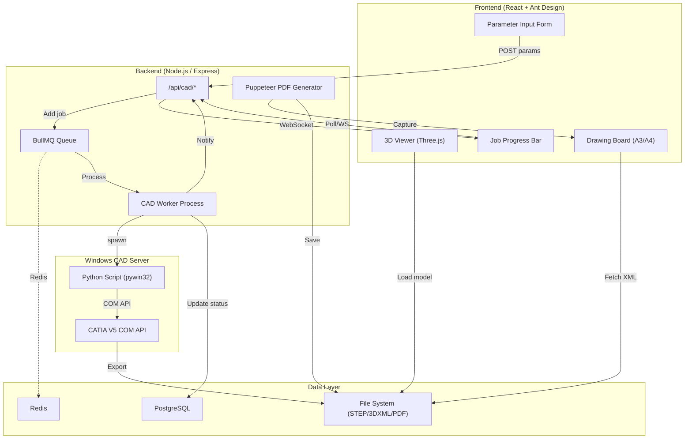

# 3D CAD PDF Automation System — Implementation Plan

## Overview

Build a web application module within the EngineerSystem monorepo that automates 3D CAD rendering via CATIA V5, displays interactive 3D models with PMI annotations, and generates engineering PDF drawings — all orchestrated through a BullMQ job queue.

### Architecture Diagram



---

## User Review Required

> [!IMPORTANT]
> **CATIA V5 License & Environment**: This system requires a running CATIA V5 instance on the Windows Server. The Python script uses COM automation — CATIA must be installed with proper licensing. Headless CATIA V5 is **not officially supported** by Dassault; the script will use background mode with `Visible = False`.

> [!WARNING]
> **HOOPS Web Viewer vs Three.js**: HOOPS Communicator from Tech Soft 3D requires a commercial license (~$15K+/year). This plan uses **Three.js** with a STEP/glTF loader approach. True PMI/3D Annotation rendering from STEP AP242 is limited in Three.js — we implement a **custom PMI overlay** system using annotation data extracted during CATIA export. If native PMI support is critical, HOOPS licensing should be pursued separately.

> [!IMPORTANT]
> **Redis Requirement**: The existing FEA module already uses Redis + BullMQ. This module reuses the same connection pattern from [fea_queue.js](file:///d:/97_Projects/00_System/EngineerSystem/apps/ENG-Backend/api/fea/fea_queue.js). Redis must be running on the server.

---

## Open Questions

> [!IMPORTANT]
> 1. **CATIA V5 Version**: Which exact CATIA V5 version/release is installed on your Windows Server? (e.g., V5-6R2019, V5-6R2021). The COM API type libraries vary.
> 2. **Design Table vs Direct Parameters**: Do your `.CATPart`/`.CATProduct` files use Excel-based Design Tables, or direct CATIA Parameters? The script will support both, but the primary path matters for initial testing.
> 3. **Export Format Preference**: STEP AP242 preserves PMI metadata but is heavier; 3D XML is Dassault's native format. Do you want both, or a primary format? The plan implements both with a config toggle.
> 4. **Python Environment**: Is Python already installed on the Windows Server? Which version? Do you use `pywin32` already?
> 5. **A3 vs A4**: The drawing board layout — should we default to A3 landscape (common for engineering drawings) or A4?

---

## Proposed Changes

### Phase 1: Python CATIA V5 Controller

The Python script is the core automation engine. It runs on the Windows CAD Server and is invoked by the Node.js BullMQ worker via `child_process.spawn`.

#### [NEW] [catia_controller.py](file:///d:/97_Projects/00_System/EngineerSystem/apps/ENG-Backend/cad_worker/catia_controller.py)

Main Python script with the following responsibilities:
- **Initialize CATIA COM**: Connect to running CATIA instance or launch new one via `win32com.client.Dispatch("CATIA.Application")`
- **Open Document**: Accept `.CATPart` or `.CATProduct` path, open with `Documents.Open()`
- **Read JSON Payload**: Parse parameters from CLI arg `--params <json_file_path>` or stdin
- **Update Parameters**: Two modes:
  - **Direct**: Iterate `Part.Parameters` collection, find by name, set `.Value`
  - **Design Table**: Open linked Excel, modify cells, close Excel, refresh Design Table
- **Rebuild/Update**: Call `Part.Update()` to trigger CATIA global update
- **Camera Setup**: Manipulate `ActiveViewer.Viewpoint3D` to set optimal camera for export (Fit All, isometric view)
- **Export**: 
  - STEP AP242: `Part.ExportData(outputPath, "stp")` with settings for PMI
  - 3D XML: `Part.ExportData(outputPath, "3dxml")`
  - glTF: Convert STEP → glTF via `cadquery` or `opencascade` for web viewing
- **Cleanup**: `Document.Close()`, release COM objects, `gc.collect()`, `pythoncom.CoUninitialize()`
- **Error Handling**: Try/catch around every COM operation, structured JSON output to stdout

```python
# Key function signatures:
def connect_catia() -> CATIAApplication
def open_document(catia, file_path: str) -> Document
def update_parameters(document, params: dict) -> dict
def update_design_table(document, params: dict) -> dict
def rebuild_model(part) -> bool
def set_camera_fit_all(catia) -> dict
def export_step_ap242(document, output_path: str) -> str
def export_3dxml(document, output_path: str) -> str
def export_gltf(step_path: str, output_path: str) -> str
def cleanup(document, catia) -> None
```

#### [NEW] [requirements.txt](file:///d:/97_Projects/00_System/EngineerSystem/apps/ENG-Backend/cad_worker/requirements.txt)

```
pywin32>=306
pythoncom
comtypes
cadquery>=2.4.0
OCP>=7.7.0
```

#### [NEW] [config.json](file:///d:/97_Projects/00_System/EngineerSystem/apps/ENG-Backend/cad_worker/config.json)

Configuration file for:
- CATIA paths, timeout settings
- Export format preferences (STEP/3DXML/glTF)
- Output directory paths
- Camera preset values for different drawing sizes

---

### Phase 2: Frontend 3D Viewer & PMI Display

A React component using Three.js (`@react-three/fiber` + `@react-three/drei`) to render the exported 3D model with PMI overlay capabilities.

#### [NEW] [CadViewer.jsx](file:///d:/97_Projects/00_System/EngineerSystem/apps/ENG-Frontend/src/components/engineer/newprod_eng/3d_pdf/CadViewer.jsx)

Main viewer component:
- **Props**: `modelUrl` (URL to STEP/glTF file), `pmiData` (annotation data array), `onLoaded` callback
- **Three.js Scene**: Uses `@react-three/fiber` Canvas with:
  - `OrbitControls` for Pan/Zoom/Rotate
  - `Environment` preset for realistic lighting
  - `ContactShadows` for grounding
  - Gradient background
- **Model Loading**: 
  - Primary: `GLTFLoader` for .gltf/.glb files (converted from STEP)
  - Fallback: Custom STEP loader via `occt-import-js` (WebAssembly OpenCascade)
- **PMI Overlay**: Custom `<Html>` annotations from `@react-three/drei` positioned at 3D coordinates extracted during CATIA export
- **PMI Toggle**: `showPMI` state with toggle button
- **Loading State**: Ant Design `Spin` indicator during model load
- **Camera Controls**: Fit-to-bounds on model load, preset views (Top, Front, Iso)

#### [NEW] [CadViewer.css](file:///d:/97_Projects/00_System/EngineerSystem/apps/ENG-Frontend/src/components/engineer/newprod_eng/3d_pdf/CadViewer.css)

Styles for the viewer container, PMI annotation bubbles, toolbar overlay, and loading states.

#### [NEW] [PmiAnnotation.jsx](file:///d:/97_Projects/00_System/EngineerSystem/apps/ENG-Frontend/src/components/engineer/newprod_eng/3d_pdf/PmiAnnotation.jsx)

Reusable PMI annotation component:
- Renders GD&T symbols, dimension callouts, surface finish markers
- Uses `@react-three/drei` `<Html>` for screen-space annotations anchored to 3D points
- Supports different annotation types: `dimension`, `tolerance`, `surface_finish`, `datum`

#### [NEW] [ViewerToolbar.jsx](file:///d:/97_Projects/00_System/EngineerSystem/apps/ENG-Frontend/src/components/engineer/newprod_eng/3d_pdf/ViewerToolbar.jsx)

Floating toolbar component with:
- View presets (Top, Front, Right, Isometric)
- PMI visibility toggle
- Zoom to Fit button
- Screenshot capture button
- Wireframe/Solid toggle

---

### Phase 3: XML Parsing & Drawing Board Layout

The 2D layout combines engineering metadata from XML with the 3D viewer in a print-ready drawing board format.

#### [NEW] [useXmlParser.js](file:///d:/97_Projects/00_System/EngineerSystem/apps/ENG-Frontend/src/components/engineer/newprod_eng/3d_pdf/hooks/useXmlParser.js)

Custom React hook:
- Fetches XML file from backend URL
- Parses XML → JSON using `DOMParser` (browser-native, no dependency needed)
- Returns `{ data, loading, error }` state
- Handles nested XML structures for title block fields

#### [NEW] [DrawingBoard.jsx](file:///d:/97_Projects/00_System/EngineerSystem/apps/ENG-Frontend/src/components/engineer/newprod_eng/3d_pdf/DrawingBoard.jsx)

Main unified component combining 3D viewer + data layout:
- **Paper Layout**: Fixed dimensions for A3 landscape (420mm × 297mm at 96dpi = 1587px × 1123px) or A4
- **Title Block**: Bottom-right engineering title block using Ant Design `Descriptions` and `Table`:
  - Part Number, Part Name, Material
  - Scale, Sheet number, Revision
  - Drawn by, Checked by, Approved by (with dates)
  - Company logo, tolerances
- **3D Viewport**: Takes ~70% of the drawing area
- **Data Panel**: Right/bottom sidebar with parameter table
- **Print-Ready CSS**: `@media print` rules to remove UI chrome, scale to page

#### [NEW] [TitleBlock.jsx](file:///d:/97_Projects/00_System/EngineerSystem/apps/ENG-Frontend/src/components/engineer/newprod_eng/3d_pdf/TitleBlock.jsx)

Engineering drawing title block component:
- ISO 7200 compliant layout
- Ant Design `Row`, `Col`, `Descriptions` components
- Fields: Part No, Description, Material, Weight, Scale, Tolerance, Revision, etc.
- Signature blocks with date fields

#### [NEW] [DrawingBoard.css](file:///d:/97_Projects/00_System/EngineerSystem/apps/ENG-Frontend/src/components/engineer/newprod_eng/3d_pdf/DrawingBoard.css)

Print-optimized styles:
- Fixed aspect ratio container
- Engineering drawing border (thick outer, thin inner)
- `@media print` overrides:
  - Hide toolbar, buttons, scrollbars
  - Set exact page dimensions
  - Force background printing
- `@media screen` normal interactive styles

---

### Phase 4: Backend API, Job Queue & CAD Worker Integration

Reuses the proven BullMQ + Redis pattern from the existing [FEA module](file:///d:/97_Projects/00_System/EngineerSystem/apps/ENG-Backend/api/fea).

#### [NEW] [cad_queue.js](file:///d:/97_Projects/00_System/EngineerSystem/apps/ENG-Backend/api/cad/cad_queue.js)

BullMQ queue setup (mirrors [fea_queue.js](file:///d:/97_Projects/00_System/EngineerSystem/apps/ENG-Backend/api/fea/fea_queue.js)):
- Queue name: `cad-generation-queue`
- Reuses `getRedisConnection()` pattern with silent retry
- Exports `cadQueue`, `connection`, `getRedisConnection`

#### [NEW] [cad_router.js](file:///d:/97_Projects/00_System/EngineerSystem/apps/ENG-Backend/api/cad/cad_router.js)

Express router (mirrors [fea_router.js](file:///d:/97_Projects/00_System/EngineerSystem/apps/ENG-Backend/api/fea/fea_router.js)):
- `POST /api/cad/generate` — Accept user parameters, add BullMQ job, return `jobId`
- `GET /api/cad/status/:jobId` — Return job state, progress, result/error
- `GET /api/cad/result/:jobId` — Serve exported model file (STEP/glTF) and metadata XML
- `GET /api/cad/pdf/:jobId` — Serve generated PDF
- `POST /api/cad/pdf/:jobId/generate` — Trigger PDF generation for a completed job
- WebSocket integration via `req.app.get('io')` for real-time progress
- QueueEvents listeners for `progress`, `completed`, `failed`

#### [NEW] [cad_worker.js](file:///d:/97_Projects/00_System/EngineerSystem/apps/ENG-Backend/api/cad/cad_worker.js)

BullMQ worker (mirrors [fea_worker.js](file:///d:/97_Projects/00_System/EngineerSystem/apps/ENG-Backend/api/fea/fea_worker.js)):
- Spawns Python `catia_controller.py` via `child_process.spawn`
- Passes parameters as JSON temp file
- Captures stdout for `PROGRESS:` markers → `job.updateProgress()`
- On completion: stores result metadata in PostgreSQL `cad_jobs` table
- Handles timeout (configurable, default 5 minutes for CATIA operations)
- File paths for output stored in job result

#### [NEW] [cad_constants.js](file:///d:/97_Projects/00_System/EngineerSystem/apps/ENG-Backend/api/cad/cad_constants.js)

Constants for:
- Table names (`cad_jobs`, `cad_parameters`)
- File paths (output directory, temp directory)
- Job status enum (`PENDING`, `PROCESSING`, `COMPLETED`, `FAILED`)
- CATIA camera preset values

#### [NEW] [cad_model.js](file:///d:/97_Projects/00_System/EngineerSystem/apps/ENG-Backend/api/cad/cad_model.js)

Database model for PostgreSQL operations:
- `createJob(userId, params)` → INSERT into `cad_jobs`
- `updateJobStatus(jobId, status, result)` → UPDATE
- `getJobById(jobId)` → SELECT
- `getJobsByUser(userId)` → SELECT with pagination
- Uses parameterized queries (SQL injection prevention per project conventions)

#### CATIA Camera Manipulation (Phase 4 Requirement)

The `catia_controller.py` handles camera manipulation via:
```python
def set_camera_fit_all(catia):
    """
    Manipulate CATIA camera to center model with annotations.
    Uses Viewpoint3D to set origin, up-direction, sight-direction,
    and field-of-view. Then calls viewer.Reframe() for Fit All.
    """
    viewer = catia.ActiveWindow.ActiveViewer
    vp = viewer.Viewpoint3D
    
    # Set isometric view
    vp.PutSightDirection([1, -1, 1])
    vp.PutUpDirection([0, 0, 1])
    
    # Fit All
    viewer.Reframe()
    
    # Optional: Zoom out slightly to include PMI annotations
    vp.FieldOfView = vp.FieldOfView * 1.15
```

---

### Phase 5: PDF Generation with Puppeteer

#### [NEW] [pdfGenerator.js](file:///d:/97_Projects/00_System/EngineerSystem/apps/ENG-Backend/api/cad/pdfGenerator.js)

Puppeteer-based PDF generator:
- Launches headless Chromium (`puppeteer.launch({ headless: 'new' })`)
- Navigates to `http://localhost:3000/drawing/:jobId`
- Waits for:
  - 3D model loaded: `page.waitForSelector('[data-model-loaded="true"]')`
  - XML data rendered: `page.waitForSelector('[data-xml-loaded="true"]')`
  - Network idle: `page.waitForNetworkIdle({ idleTime: 2000 })`
- Injects print CSS class to trigger `@media print` styles
- Captures as PDF:
  ```javascript
  const pdfBuffer = await page.pdf({
      format: 'A3',
      landscape: true,
      printBackground: true,
      preferCSSPageSize: true,
      margin: { top: 0, right: 0, bottom: 0, left: 0 }
  });
  ```
- Saves to `output/cad_pdfs/job_<id>.pdf`
- Returns buffer to API for download
- Handles WebGL context: uses `--enable-webgl` and `--use-gl=angle` flags for 3D rendering in headless mode

> [!WARNING]
> Puppeteer's headless mode may not render WebGL/Three.js perfectly. Alternative approaches if issues arise:
> 1. Use `page.screenshot()` for the 3D viewport and composite with PDF metadata via `pdf-lib` (already a project dependency)
> 2. Use the CATIA Python script to capture a high-res viewport image during export, then embed that image in the PDF layout

---

### Phase 6: Database Schema, Polling Hook & Integration

#### [NEW] [cad_schema.sql](file:///d:/97_Projects/00_System/EngineerSystem/db/migrations/cad_schema.sql)

```sql
-- CAD Job Requests table
CREATE TABLE IF NOT EXISTS cad_jobs (
    id SERIAL PRIMARY KEY,
    job_id VARCHAR(64) UNIQUE NOT NULL,        -- BullMQ job ID
    user_id VARCHAR(20) NOT NULL,              -- Employee number
    status VARCHAR(20) DEFAULT 'PENDING',      -- PENDING/PROCESSING/COMPLETED/FAILED
    input_file_path TEXT,                       -- Original .CATPart/.CATProduct path
    parameters JSONB,                          -- User-submitted parameter values
    output_step_path TEXT,                     -- Exported STEP file path
    output_gltf_path TEXT,                     -- Converted glTF path for web viewer
    output_3dxml_path TEXT,                    -- 3D XML export path
    output_pdf_path TEXT,                      -- Generated PDF path
    output_metadata_xml TEXT,                  -- Metadata XML path
    pmi_data JSONB,                           -- Extracted PMI/annotation data
    error_message TEXT,                        -- Error details on failure
    progress_message TEXT,                     -- Latest progress update
    catia_duration_ms INTEGER,                 -- CATIA processing time
    pdf_duration_ms INTEGER,                   -- PDF generation time
    created_at TIMESTAMPTZ DEFAULT NOW(),
    updated_at TIMESTAMPTZ DEFAULT NOW(),
    completed_at TIMESTAMPTZ
);

-- Index for user job lookup
CREATE INDEX idx_cad_jobs_user ON cad_jobs(user_id);
CREATE INDEX idx_cad_jobs_status ON cad_jobs(status);
CREATE INDEX idx_cad_jobs_created ON cad_jobs(created_at DESC);

-- CAD Parameter Templates (reusable configs)
CREATE TABLE IF NOT EXISTS cad_param_templates (
    id SERIAL PRIMARY KEY,
    name VARCHAR(100) NOT NULL,
    description TEXT,
    catpart_path TEXT NOT NULL,                -- Default .CATPart file
    parameters JSONB NOT NULL,                 -- Default parameter schema/values
    created_by VARCHAR(20),
    created_at TIMESTAMPTZ DEFAULT NOW(),
    updated_at TIMESTAMPTZ DEFAULT NOW()
);
```

#### [NEW] [useCadJobPolling.js](file:///d:/97_Projects/00_System/EngineerSystem/apps/ENG-Frontend/src/components/engineer/newprod_eng/3d_pdf/hooks/useCadJobPolling.js)

React hook for polling job status:
- Accepts `jobId`
- Polls `GET /api/cad/status/:jobId` every 2 seconds while status is `PENDING` or `PROCESSING`
- Returns `{ status, progress, result, error, isLoading }`
- Auto-stops polling on `COMPLETED` or `FAILED`
- Includes WebSocket upgrade path: if socket.io available, subscribe to `cad_${jobId}` room

#### [NEW] [CadJobDashboard.jsx](file:///d:/97_Projects/00_System/EngineerSystem/apps/ENG-Frontend/src/components/engineer/newprod_eng/3d_pdf/CadJobDashboard.jsx)

Main page component integrating all phases:
- **Parameter Form**: Ant Design form for user input (dynamic fields from template)
- **Submit → Queue**: POST to `/api/cad/generate`
- **Progress Bar**: Ant Design `Progress` + `Steps` showing job pipeline stages
- **3D Preview**: `CadViewer` loads when model export is complete
- **Drawing Board**: `DrawingBoard` renders when all data is available
- **PDF Download**: Button triggers PDF generation and download
- **Job History**: Table showing past jobs with status and re-download links

#### [NEW] [cadStore.js](file:///d:/97_Projects/00_System/EngineerSystem/apps/ENG-Frontend/src/stores/cadStore.js)

Zustand store for CAD module state:
- `currentJobId`, `jobStatus`, `progress`
- `modelUrl`, `pmiData`, `xmlData`
- `submitJob(params)`, `fetchJobStatus(jobId)`, `downloadPdf(jobId)`

#### [MODIFY] [server.js](file:///d:/97_Projects/00_System/EngineerSystem/apps/ENG-Backend/server.js)

Add CAD module routes (same pattern as FEA at line 355-361):
```javascript
//--------------------CAD Generation Module---------------------//
const cadRouter = require('./api/cad/cad_router');
require('./api/cad/cad_worker');
app.use('/api/cad', cadRouter);
app.use('/cad-output', express.static(path.join(__dirname, 'output', 'cad_results')));
```

#### [MODIFY] [home_newprod.jsx](file:///d:/97_Projects/00_System/EngineerSystem/apps/ENG-Frontend/src/components/engineer/newprod_eng/home_newprod.jsx)

Add navigation card for the new "3D CAD PDF" tool in the New Product Engineering home page.

---

## File Structure Summary

```
apps/ENG-Backend/
├── api/cad/
│   ├── cad_queue.js          # BullMQ queue setup
│   ├── cad_router.js         # Express routes
│   ├── cad_worker.js         # BullMQ worker
│   ├── cad_model.js          # PostgreSQL model
│   ├── cad_constants.js      # Constants
│   └── pdfGenerator.js       # Puppeteer PDF engine
├── cad_worker/
│   ├── catia_controller.py   # Python CATIA V5 automation
│   ├── requirements.txt      # Python dependencies
│   └── config.json           # CAD worker configuration
└── output/cad_results/       # Generated files (STEP, glTF, PDF)

apps/ENG-Frontend/src/components/engineer/newprod_eng/3d_pdf/
├── CadJobDashboard.jsx       # Main page component
├── CadViewer.jsx             # Three.js 3D viewer
├── CadViewer.css             # Viewer styles
├── PmiAnnotation.jsx         # PMI overlay component
├── ViewerToolbar.jsx         # Viewer toolbar
├── DrawingBoard.jsx          # A3/A4 drawing layout
├── DrawingBoard.css          # Print-ready styles
├── TitleBlock.jsx            # ISO 7200 title block
└── hooks/
    ├── useXmlParser.js       # XML parsing hook
    └── useCadJobPolling.js   # Job status polling hook

apps/ENG-Frontend/src/stores/
└── cadStore.js               # Zustand store

db/migrations/
└── cad_schema.sql            # PostgreSQL schema
```

---

## Verification Plan

### Automated Tests

1. **Python Script**: Unit tests for parameter parsing, JSON I/O, error handling (can be tested without CATIA using mock COM)
2. **Backend API**: Jest + Supertest for route validation:
   ```bash
   cd apps/ENG-Backend && npm test -- --testPathPattern=cad
   ```
3. **Frontend Components**: React Testing Library for component rendering
4. **Integration**: Test full pipeline with a sample `.CATPart` file:
   ```bash
   python catia_controller.py --input sample.CATPart --params params.json --output ./test_output
   ```

### Manual Verification

1. **Phase 1**: Run Python script standalone on Windows Server with CATIA → verify STEP/glTF output
2. **Phase 2**: Load a sample glTF model in the viewer → verify controls, PMI toggle
3. **Phase 3**: Render drawing board with mock XML data → verify A3 aspect ratio in browser
4. **Phase 4**: Submit a job via API → verify BullMQ queue, worker execution, DB update
5. **Phase 5**: Generate PDF → verify layout matches screen, no UI artifacts
6. **Phase 6**: Full end-to-end: submit params → CATIA update → 3D preview → PDF download

### Build Verification

```bash
# Frontend builds without errors
cd apps/ENG-Frontend && npm run build

# Backend starts without import errors
cd apps/ENG-Backend && node -e "require('./api/cad/cad_router')"
```
